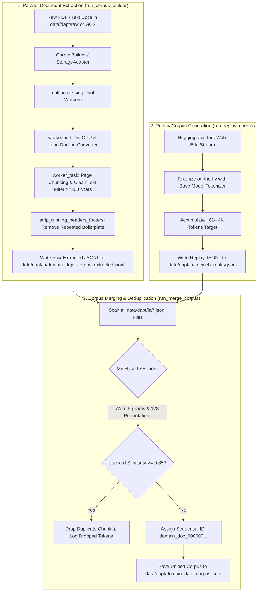

# Step 1: Corpus Construction & Engineering (`lib/s1_build_corpus`)

This module implements **Step 1 (Corpus Construction)** of the Semantics Layer Pipeline. It extracts domain text from scientific PDFs and document files using GPU/CPU-accelerated Docling parsers, streams general web replay data from FineWeb-Edu, cleans and strips running headers/footers, and applies zero-dependency MinHash Locality-Sensitive Hashing (LSH) near-duplicate deduplication to construct a unified, high-quality neuroscience Domain Adaptive Pretraining (DAPT) corpus.

---

## 1. Objectives

- **Scientific Text Extraction**: Extract clean Markdown text and layout structures (sections, tables, math formulas, code) from scientific PDFs and documents in parallel using Docling.
- **Quality Filtering & Boilerplate Stripping**: Filter out low-quality/junk content (< 300 characters) and strip document-level running headers, footers, and repeated boilerplate across document chunks.
- **General Web Replay Stream**: Stream FineWeb-Edu replay data (~614.4K tokens) using the student model tokenizer to prevent catastrophic forgetting during DAPT.
- **Near-Duplicate Deduplication**: Perform MinHash Locality-Sensitive Hashing (LSH) deduplication across word 5-grams (Jaccard similarity threshold = 0.85) to remove duplicate document chunks across input files.
- **Unified Corpus Assembly**: Output a single, clean, sequentially indexed JSONL corpus (`domain_dapt_corpus.jsonl`) ready for downstream pre-tokenization (Step 2).

---

## 2. Inputs

- **Local Raw PDFs & Documents**: Located in `cfg.build.local_directory_path` (default: `data/dapt/raw`) or streamed from a GCS bucket (`cfg.build.gcs_bucket_name`).
- **FineWeb-Edu Dataset Stream**: Streamed dynamically from HuggingFace (`HuggingFaceFW/fineweb-edu`, `sample-10BT` split).
- **Tokenizers**:
  - Student base model tokenizer loaded via `AutoTokenizer.from_pretrained(cfg.model.base_model_name)` for replay token accumulation.
  - `tiktoken` (`cl100k_base`) for running header/footer token recalculation.

---

## 3. Outputs

1. **Extracted Domain Corpus**: `cfg.build.extracted_output_path` (default: `data/dapt/in/domain_dapt_corpus_extracted.jsonl`) — Raw parsed text chunks extracted from local PDFs and document files.
2. **FineWeb-Edu Replay Stream**: `cfg.data.dapt_in_dir / "fineweb_replay.jsonl"` (default: `data/dapt/in/fineweb_replay.jsonl`) — Raw text replay documents totaling ~614.4K tokens.
3. **Unified Deduplicated Corpus**: `cfg.build.output_path` (default: `data/dapt/domain_dapt_corpus.jsonl`) — Final merged, sequentially re-indexed JSONL dataset with near-duplicates removed.

---

## 4. Configurations

All parameters are defined in `lib/utils/config.py` under `CorpusBuildConfig` (`cfg.build`) and can be overridden via environment variables:

| Parameter & Environment Variable | Default Value | Description |
| :--- | :---: | :--- |
| `cfg.build.available_gpus` `Env: AVAILABLE_GPUS` | `"0"` | Comma-separated GPU device indices or `"AUTO"`. |
| `cfg.build.workers_per_gpu` `Env: WORKERS_PER_GPU` | `1` | Worker processes allocated per GPU or `"AUTO"`. |
| `cfg.build.chunk_size` `Env: CHUNK_SIZE` | `10` | PDF page chunk size processed per worker task. |
| `cfg.build.output_path` `Env: OUTPUT_PATH` | `data/dapt/` `domain_dapt_corpus.jsonl` | Final output path for unified, deduplicated corpus. |
| `cfg.build.extracted_output_path` `Env: EXTRACTED_OUTPUT_PATH` | `data/dapt/in/` `domain_dapt_corpus_extracted.jsonl` | Output path for raw extracted PDF chunks. |
| `cfg.build.maxtasksperchild` `Env: MAX_TASKS_PER_CHILD` | `None` | Process recycling threshold to prevent CPU/VRAM memory leaks. |
| `cfg.build.docling_use_ocr` `Env: DOCLING_USE_OCR` | `False` | Enable optical character recognition in Docling. |
| `cfg.build.docling_use_table_structure` `Env: DOCLING_USE_TABLE_STRUCTURE` | `False` | Enable table structure extraction in Docling. |
| `cfg.build.docling_use_code_enrichment` `Env: DOCLING_USE_CODE_ENRICHMENT` | `False` | Enable code block enrichment in Docling. |
| `cfg.build.docling_use_formula_enrichment` `Env: DOCLING_USE_FORMULA_ENRICHMENT` | `False` | Enable mathematical formula enrichment in Docling. |
| `cfg.build.docling_use_picture_classification` `Env: DOCLING_USE_PICTURE_CLASSIFICATION` | `False` | Enable figure image classification in Docling. |
| `cfg.build.docling_use_picture_description` `Env: DOCLING_USE_PICTURE_DESCRIPTION` | `False` | Enable figure description generation in Docling. |
| `cfg.build.docling_num_threads` `Env: DOCLING_NUM_THREADS` | `4` | CPU threads per Docling converter instance. |
| `cfg.build.minhash_enabled` `Env: MINHASH_ENABLED` | `True` | Enable MinHash LSH near-duplicate deduplication during merge. |
| `cfg.build.minhash_jaccard_threshold` `Env: MINHASH_JACCARD_THRESHOLD` | `0.85` | Jaccard similarity threshold for dropping near-duplicates. |
| `cfg.build.minhash_num_perm` `Env: MINHASH_NUM_PERM` | `128` | Number of MinHash permutations (signature size). |
| `cfg.build.minhash_num_bands` `Env: MINHASH_NUM_BANDS` | `16` | Number of LSH bands for candidate bucket hashing. |
| `cfg.build.minhash_ngram_size` `Env: MINHASH_NGRAM_SIZE` | `5` | Word n-gram size for shingle extraction. |

---

## 5. List of Modules and their description

### 1. `build_corpus.py` (`run_corpus_builder` & `CorpusBuilder`)
- **Role**: Entry point and parallel execution manager for PDF and document extraction.
- **Functions & Classes**:
  - `run_corpus_builder(cfg: PipelineConfig)`: Top-level launcher. Initializes multiprocess start method (`spawn`), logging, and `StorageAdapter`, then starts `CorpusBuilder`.
  - `CorpusBuilder`: Manages a `multiprocessing.Pool` of GPU/CPU workers. Uses `maxtasksperchild` process recycling to prevent OS memory growth. Streams files asynchronously (`max_active_docs = 2 * total_workers`) while writing chunks sequentially to preserve file order.
  - `strip_running_headers_footers(chunks, filename)`: Analyzes line frequencies across all chunks of a document. Removes short lines (<80 chars) that appear in $\ge 10\%$ of chunks (threshold min 3, max 15) and recalculates token counts using `tiktoken`.

### 2. `worker.py` (`worker_init` & `worker_task`)
- **Role**: Multiprocessing worker process initialization and page-range extraction logic.
- **Functions & Classes**:
  - `worker_init(gpu_queue, docling_options, logging_cfg)`: Process initializer. Assigns GPU ID from shared `gpu_queue` to `CUDA_VISIBLE_DEVICES` and initializes the IBM Docling `DocumentConverter` with specified options (`docling_use_ocr`, `docling_use_table_structure`, etc.). Automatically falls back to PyPdfium on CPU.
  - `worker_task(filename, pdf_path, start_page, end_page, chunk_index, ...)`: Converts assigned PDF page ranges or text files to Markdown, cleans text via `clean_corpus_text()`, filters out short chunks (<300 chars), and explicitly unloads backend objects.
  - Dataclasses: `ChunkResult` (chunk index, text, token count, page range) and `ExtractionResult` (filename, chunks, status, succeeded flag).

### 3. `replay_corpus.py` (`run_replay_corpus`)
- **Role**: Streams general web replay documents to prevent catastrophic forgetting.
- **Functions & Classes**:
  - `run_replay_corpus(cfg: PipelineConfig)`: Streams FineWeb-Edu dataset (`sample-10BT`) via HuggingFace `load_dataset`. Tokenizes text on-the-fly using the student base model tokenizer (`cfg.model.base_model_name`), collects ~614.4K tokens (~600 blocks of 1024 tokens), and writes JSONL records to `data/dapt/in/fineweb_replay.jsonl`.

### 4. `merge_corpus.py` (`run_merge_corpus`)
- **Role**: Merges all extracted and replay `.jsonl` files into a single output file with deduplication.
- **Functions & Classes**:
  - `run_merge_corpus(cfg: PipelineConfig)`: Scans `cfg.data.dapt_in_dir` (`data/dapt/in/`) for all `.jsonl` files. Reads line-by-line, parses JSON records, passes chunk text through `MinHashLSHDeduplicator` (if enabled), re-indexes document IDs sequentially (`domain_doc_000000`, `domain_doc_000001`, ...), and writes unique records to `cfg.build.output_path`. Outputs statistics for processed chunks, unique chunks merged, duplicates dropped, and token counts.

### 5. `minhash_lsh.py` (`MinHashLSHDeduplicator`)
- **Role**: Pure Python zero-dependency MinHash Locality-Sensitive Hashing index for near-duplicate chunk detection.
- **Functions & Classes**:
  - `MinHashLSHDeduplicator`:
    - `extract_shingles(text)`: Tokenizes text into lowercase word 5-grams (`ngram_size=5`).
    - `compute_minhash(shingles)`: Computes $K=128$ MinHash signature values using random linear hash functions $(a_i \cdot h + b_i) \pmod{P}$ with Mersenne prime $P = 2^{61}-1$.
    - `is_duplicate_and_add(doc_id, text)`: Queries $B=16$ LSH bands ($R=8$ rows per band) to retrieve candidate document IDs. Verifies exact Jaccard similarity $J(A, B) = \frac{|A \cap B|}{|A \cup B|}$. Drops chunk if $J \ge 0.85$; otherwise adds to index and retains chunk.

### 6. `__init__.py`
- **Role**: Public API exports for `lib.s1_build_corpus`.
- **Exports**: `run_corpus_builder`, `run_replay_corpus`, `run_merge_corpus`, `MinHashLSHDeduplicator`.

---

## 6. Overall functional flow of the Step

### Detailed Functional Walkthrough

1. **Document Ingestion & Task Queueing**: `run_corpus_builder` streams documents from `data/dapt/raw` (or GCS). PDFs are partitioned page-by-page into chunks of size `cfg.build.chunk_size` (default 10 pages). Tasks are queued to a worker pool where each process is initialized with a assigned GPU and Docling converter.
2. **Parallel Extraction, Cleaning & Boilerplate Removal**: Workers convert page chunks to Markdown, clean text, and discard short chunks (<300 chars). Document-level running headers/footers appearing in $\ge 10\%$ of document chunks are automatically stripped across all chunks of that document.
3. **Replay Corpus Streaming**: `run_replay_corpus` streams FineWeb-Edu dataset (`sample-10BT`) from HuggingFace, tokenizes text using the student model tokenizer, and stops once ~614.4K tokens (~600 blocks of 1024 tokens) are written to `data/dapt/in/fineweb_replay.jsonl`.
4. **Merge & MinHash LSH Deduplication**: `run_merge_corpus` scans `data/dapt/in/` for all `.jsonl` files. Each record is processed through `MinHashLSHDeduplicator`, which extracts word 5-grams, calculates 128-permutation MinHash signatures, checks 16 LSH band buckets, and verifies exact Jaccard similarity against candidate chunks. Chunks exceeding the 0.85 Jaccard threshold are dropped. Unique records are re-indexed sequentially (`domain_doc_000000`, `domain_doc_000001`, ...) and written to the final output file `data/dapt/domain_dapt_corpus.jsonl`.
