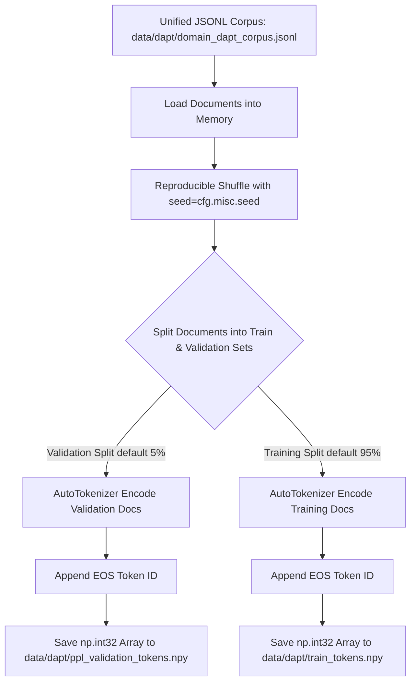

# Step 2: Offline Pre-tokenization (`lib/s2_pretokenize`)

This module implements **Step 2 (Offline Pre-tokenization)** of the Semantics Layer Pipeline. It converts the unified JSONL pre-training corpus produced in Step 1 into binary token arrays for efficient streaming during Domain Adaptive Pretraining (DAPT, Step 3).

---

## 1. Objectives

- **Corpus Shuffling & Validation Split**: Stream-read the unified JSONL corpus (`domain_dapt_corpus.jsonl`), reproducibly shuffle documents based on a fixed seed (`cfg.misc.seed`), and split documents into training and validation sets (default validation ratio `val_ratio = 0.05`, configurable).
- **Fast Tokenization**: Tokenize documents using the student base model's HuggingFace tokenizer (`cfg.model.base_model_name`), appending End-Of-Sequence (`EOS`) token IDs after each document.
- **Binary Array Formatting**: Convert training and validation token sequences into flat 32-bit integer NumPy arrays (`int32`) saved directly to disk (`.npy` files) for high-performance memory-mapped I/O during training and evaluation.
- **Validation Perplexity Setup**: Prepare the validation perplexity token array (`ppl_validation_tokens.npy`) to serve as Probe B during DAPT evaluation.

---

## 2. Inputs

- **Unified Domain Corpus**: `cfg.build.output_path` (default: `data/dapt/domain_dapt_corpus.jsonl`) — Unified, deduplicated JSONL corpus output by Step 1.
- **Base Model Tokenizer**: Loaded dynamically via HuggingFace `AutoTokenizer.from_pretrained(cfg.model.base_model_name)` (e.g. `HuggingFaceTB/SmolLM2-135M` or `Qwen/Qwen3-0.6B`).

---

## 3. Outputs

1. **Pre-tokenized Training Tokens**: `cfg.data.pretokenized_bin_path` (default: `data/dapt/train_tokens.npy`) — Flat 32-bit NumPy array containing tokenized training documents appended with EOS tokens.
2. **Validation Perplexity Tokens**: `cfg.data.ppl_corpus_path` (default: `data/dapt/ppl_validation_tokens.npy`) — Flat 32-bit NumPy array containing tokenized validation documents for Probe B perplexity evaluation.

---

## 4. Configurations

All parameters are defined in `lib/utils/config.py` under `DataConfig` (`cfg.data`), `ModelConfig` (`cfg.model`), and `MiscConfig` (`cfg.misc`), overridable via environment variables:

| Parameter & Environment Variable | Default Value | Description |
| :--- | :---: | :--- |
| `cfg.build.output_path` `Env: OUTPUT_PATH` | `data/dapt/` `domain_dapt_corpus.jsonl` | Input unified JSONL corpus path from Step 1. |
| `cfg.data.pretokenized_bin_path` `Env: PRETOKENIZED_BIN_PATH` | `data/dapt/` `train_tokens.npy` | Output binary `.npy` file path for tokenized training dataset. |
| `cfg.data.ppl_corpus_path` `Env: PPL_CORPUS_PATH` | `data/dapt/` `ppl_validation_tokens.npy` | Output binary `.npy` file path for tokenized validation dataset. |
| `cfg.model.base_model_name` `Env: BASE_MODEL_NAME` | `HuggingFaceTB/` `SmolLM2-135M` | Student base model identifier used to load HuggingFace tokenizer. |
| `cfg.misc.seed` `Env: SEED` | `42` | Random seed used for reproducible document shuffling before split. |

---

## 5. List of Modules and their description

### 1. `pretokenize.py` (`run_pretokenization`)
- **Role**: Core pre-tokenization execution module.
- **Functions & Classes**:
  - `run_pretokenization(cfg: PipelineConfig, val_ratio: float = 0.05)`:
    - Reads line-by-line JSONL document records from `cfg.build.output_path`.
    - Seeds `random.seed(cfg.misc.seed)` and shuffles the document list.
    - Partitions documents into `val_size = max(2, int(total_docs * val_ratio))` validation documents and `train_size = total_docs - val_size` training documents.
    - Loads `AutoTokenizer.from_pretrained(cfg.model.base_model_name)` and sets `model_max_length = 100_000_000`.
    - Encodes validation documents without special tokens, appends `eos_token_id`, and saves to `cfg.data.ppl_corpus_path` as an `np.int32` array.
    - Encodes training documents sequentially, appends `eos_token_id`, logs progress every 100 documents, and saves to `cfg.data.pretokenized_bin_path` as an `np.int32` array.

### 2. `__init__.py`
- **Role**: Public API exports for `lib.s2_pretokenize`.
- **Exports**: `run_pretokenization`.

---

## 6. Overall functional flow of the Step

### Detailed Functional Walkthrough

1. **Corpus Loading & Validation**: `run_pretokenization` reads `cfg.build.output_path` (`data/dapt/domain_dapt_corpus.jsonl`) line-by-line, verifying that the file exists and contains valid document records.
2. **Reproducible Shuffling & Dataset Splitting**: The document list is shuffled using `random.seed(cfg.misc.seed)` to ensure identical train/val partitioning across runs. The dataset is split into `val_ratio` (default 5%) validation documents and remaining training documents.
3. **Validation Tokenization (Probe B Setup)**: Validation documents are encoded using `tokenizer.encode(text, add_special_tokens=False)`. An EOS token ID (`tokenizer.eos_token_id`) is appended to each document. The tokens are converted to a 32-bit integer NumPy array (`np.int32`) and saved to disk at `cfg.data.ppl_corpus_path` (`data/dapt/ppl_validation_tokens.npy`).
4. **Training Tokenization**: Training documents are encoded sequentially in the same manner. Progress is logged every 100 documents. The resulting token array is converted to `np.int32` and saved to `cfg.data.pretokenized_bin_path` (`data/dapt/train_tokens.npy`), ready for direct memory-mapped loading by PyTorch `Dataset` during Step 3 (DAPT).
