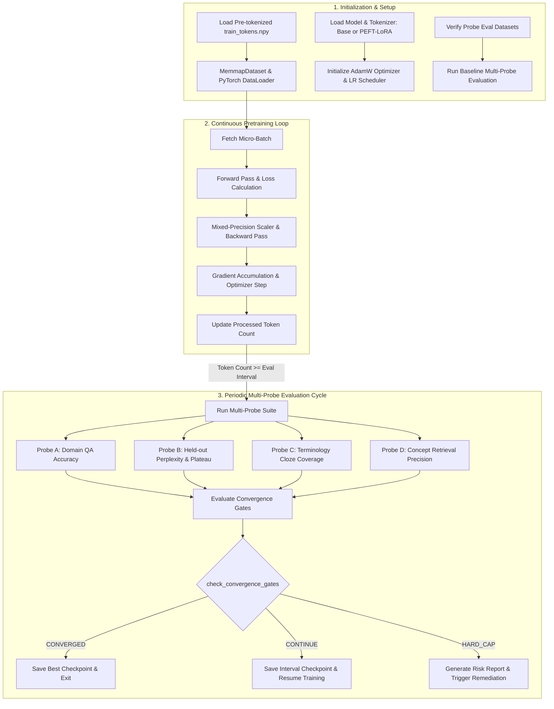

# Step 3: Domain Adaptive Pretraining & Gated Evaluation (`lib/s3_dapt`)

This module implements **Step 3 (Domain Adaptive Pretraining — DAPT)** of the Semantics Layer Pipeline. It performs continued pretraining on the student base model using the pre-tokenized neuroscience corpus, runs online multi-probe evaluations at regular token intervals, and enforces multi-gate convergence criteria for dynamic early stopping.

---

## 1. Objectives

- **Continued Domain Pretraining**: Perform causal language modeling pretraining on the student base model (e.g. `SmolLM2-135M` or `Qwen3-0.6B`) using pre-tokenized binary token arrays (`train_tokens.npy`). Supports full-parameter pretraining and Parameter-Efficient Fine-Tuning (PEFT-LoRA via `cfg.model.peft_dapt`).
- **Online Multi-Probe Evaluation Suite**: Execute four distinct evaluation probes at configurable token intervals (`cfg.corpus.eval_interval_tokens`):
  - **Probe A (Domain QA Accuracy)**: Multiple-choice & open-ended neuroscience QA accuracy.
  - **Probe B (Held-Out Perplexity)**: Cross-entropy loss and perplexity evaluation on held-out validation tokens (`ppl_validation_tokens.npy`).
  - **Probe C (Terminology Cloze Coverage)**: Masked domain term prediction accuracy across domain vocabulary.
  - **Probe D (Concept Retrieval Precision)**: Embedding cosine similarity precision between concept prompts and reference passages.
- **Dynamic Multi-Gate Convergence Check**: Check three-gate convergence criteria to determine early stopping:
  - **Primary Gate A**: QA Accuracy $\ge$ threshold (default 0.70).
  - **Primary Gate B**: Perplexity improvement plateau over sliding window (default $<0.5\%$ improvement over 3 evaluations).
  - **Secondary Gate**: Terminology Cloze Coverage $\ge 0.65$ OR Concept Retrieval Precision $\ge 0.60$.
- **Hard-Cap Risk Mitigation**: If training reaches the hard-stop limit (`hard_stop_tokens`, e.g. 50B tokens or max epochs) without full convergence, generate a structured risk assessment report (`dapt_hard_cap_risk_report.json`) and route to remediation strategies.
- **Checkpointing & Failure Diagnostics**: Save best and rolling model checkpoints with resume capability (`RESTART_TRAINING_FROM_CHECKPOINT`), and log failed probe inferences to disk for post-training inspection.

---

## 2. Inputs

- **Pre-tokenized Training Tokens**: `cfg.data.pretokenized_bin_path` (`data/dapt/train_tokens.npy`) — Flat 32-bit integer array output by Step 2.
- **Validation Perplexity Tokens**: `cfg.data.ppl_corpus_path` (`data/dapt/ppl_validation_tokens.npy`) — Flat 32-bit integer array for Probe B evaluation.
- **QA Probe Dataset**: `cfg.data.qa_probe_path` (`evals/dapt/probe_qa.jsonl`) — Neuroscience QA pairs for Probe A evaluation.
- **Terminology Cloze Set**: `cfg.data.vocab_cloze_path` (`evals/dapt/vocab_cloze_set.json`) — Domain term cloze items for Probe C evaluation.
- **Concept Prompts & References**: `cfg.data.retrieval_prompts_path` (`evals/dapt/retrieval_prompts.json`) & `cfg.data.retrieval_references_path` (`evals/dapt/retrieval_references.json`) — Retrieval prompt/reference pairs for Probe D evaluation.

---

## 3. Outputs

1. **Model Checkpoints**: `cfg.model.checkpoint_dir` (`models/checkpoints/`) — Model weights saved per evaluation interval or epoch (supporting full weights or LoRA adapters).
2. **Best Checkpoint Manifest**: `cfg.model.best_checkpoint_manifest` (`logs/best_checkpoint.json`) — Manifest recording the top-performing checkpoint path, evaluation scores, and global step count.
3. **Evaluation Metrics Log**: `cfg.logging.metrics_log_file` (`logs/dapt_eval_metrics.jsonl`) — Line-delimited JSON log capturing step-by-step training loss, perplexity, QA accuracy, cloze coverage, concept precision, and gate decision states.
4. **Hard-Cap Risk Report**: `cfg.storage.risk_report_path` (`logs/dapt_hard_cap_risk_report.json`) — Risk assessment report generated if training reaches hard-cap limits without convergence.

---

## 4. Configurations

All parameters are defined in `lib/utils/config.py` under `DAPTConfig` (`cfg.model`, `cfg.optimizer`, `cfg.corpus`, `cfg.gates`, `cfg.data`, `cfg.logging`), overridable via environment variables:

| Parameter & Environment Variable | Default Value | Description |
| :--- | :---: | :--- |
| `cfg.model.base_model_name` `Env: BASE_MODEL_NAME` | `HuggingFaceTB/` `SmolLM2-135M` | Student base model identifier or local path. |
| `cfg.model.model_dtype` `Env: MODEL_DTYPE` | `bfloat16` | Model execution precision (`bfloat16`, `float16`, `float32`). |
| `cfg.model.max_seq_len` `Env: MAX_SEQ_LEN` | `512` | Context window sequence length per training block. |
| `cfg.model.peft_dapt` `Env: PEFT_DAPT` | `False` | Enable PEFT-LoRA fine-tuning instead of full parameter pretraining. |
| `cfg.model.lora_r` `Env: LORA_R` | `16` | LoRA rank dimension. |
| `cfg.model.lora_alpha` `Env: LORA_ALPHA` | `32` | LoRA scaling factor. |
| `cfg.model.lora_target_modules` `Env: LORA_TARGET_MODULES` | `q_proj,v_proj,` `k_proj,o_proj` | Target projection modules for LoRA adaptation. |
| `cfg.optimizer.learning_rate` `Env: LEARNING_RATE` | `3e-4` | Initial learning rate. |
| `cfg.optimizer.train_batch_size` `Env: TRAIN_BATCH_SIZE` | `8` | Micro-batch size per training step per GPU. |
| `cfg.optimizer.gradient_accumulation_steps` `Env: GRADIENT_ACCUMULATION_STEPS` | `4` | Gradient accumulation steps before optimizer step. |
| `cfg.corpus.eval_interval_tokens` `Env: EVAL_INTERVAL_TOKENS` | `100,000,000` | Token interval between online multi-probe evaluations. |
| `cfg.gates.qa_acc_threshold` `Env: QA_ACC_THRESHOLD` | `0.70` | Primary Gate A convergence threshold for QA accuracy. |
| `cfg.gates.ppl_improvement_threshold` `Env: PPL_IMPROVEMENT_THRESHOLD` | `0.005` | Primary Gate B perplexity improvement threshold (0.5%). |
| `cfg.gates.cloze_threshold` `Env: CLOZE_THRESHOLD` | `0.65` | Secondary gate threshold for terminology cloze coverage. |
| `cfg.gates.concept_threshold` `Env: CONCEPT_THRESHOLD` | `0.60` | Secondary gate threshold for concept retrieval precision. |

---

## 5. List of Modules and their description

### 1. `dapt.py` (`run_dapt_pipeline` & `run_training_loop`)
- **Role**: Main training pipeline orchestration module.
- **Functions & Classes**:
  - `run_dapt_pipeline(cfg: DAPTConfig)`: Public launcher function. Wraps training execution with execution timing and memory-mapped resource cleanup.
  - `run_dapt_pipeline_impl(cfg, resources)`: Environment setup, model/tokenizer instantiation, DataLoader creation via `MemmapDataset`, optimizer & scheduler initialization, checkpoint restoration handling, baseline evaluation execution, and main loop entry.
  - `run_training_loop(...)`: Step-by-step training loop. Manages mixed precision (`torch.cuda.amp.autocast`), gradient accumulation, optimizer steps, token counting, periodic probe evaluation cycles, best checkpoint saving, and gate decision handling (`CONVERGED`, `CONTINUE`, `HARD_CAP`).

### 2. `dataset.py` (`MemmapDataset`)
- **Role**: PyTorch `Dataset` wrapper for memory-mapped binary token arrays (`.npy`).
- **Functions & Classes**:
  - `MemmapDataset(tokens, block_size)`: Slices memory-mapped token arrays into non-overlapping blocks of length `block_size` (e.g. 512 tokens). Returns dict containing `input_ids`, `attention_mask`, and `labels`.

### 3. `model_utils.py` (`load_model_and_tokenizer`)
- **Role**: Model instantiation and GPU optimization setup.
- **Functions & Classes**:
  - `load_model_and_tokenizer(cfg: DAPTConfig, device)`: Loads HuggingFace `AutoModelForCausalLM` and `AutoTokenizer`. Sets `pad_token = eos_token`. Configures SDPA (`scaled_dot_product_attention`) and `bfloat16`/`float16` precision on CUDA. Configures PEFT-LoRA via `peft.LoraConfig` if `cfg.model.peft_dapt` is True.

### 4. `training_helpers.py`
- **Role**: Auxiliary helper functions for training environment setup and evaluation cycling.
- **Functions & Classes**:
  - `setup_training_environment(cfg, device)`: Configures random seeds, logger settings, and PyTorch execution flags.
  - `verify_eval_files(cfg)`: Validates that all probe evaluation datasets exist before launching training.
  - `init_optimizer_scheduler(cfg, model, num_batches)`: Instantiates AdamW optimizer and cosine learning rate scheduler.
  - `handle_evaluation_cycle(...)`: Executes probe evaluation suite, updates metrics logs, checks convergence gates, updates `best_checkpoint.json`, and manages checkpoint retention.
  - `run_final_eval(...)`: Executes final evaluation run upon convergence or training completion.

### 5. `evaluation/eval_runner.py` (`run_all_probes`)
- **Role**: Multi-probe evaluation execution during training intervals.
- **Functions & Classes**:
  - `run_all_probes(model, tokenizer, cfg, ...)`: Sequentially executes Probes A, B, C, and D, logging individual probe metrics and updating evaluation history.

### 6. `evaluation/gate_logic.py` (`check_convergence_gates` & `handle_hard_cap`)
- **Role**: Convergence decision engine and hard-cap remediation router.
- **Functions & Classes**:
  - `DAPTDecision`: Enum representing gate decisions (`CONVERGED`, `CONTINUE`, `HARD_CAP`).
  - `check_convergence_gates(...)`: Evaluates Primary Gate A (QA Accuracy), Primary Gate B (Perplexity plateau), and Secondary Gate (Cloze coverage OR Concept precision).
  - `handle_hard_cap(...)`: Triggered on hard stop limit. Generates a structured risk report (`dapt_hard_cap_risk_report.json`) and recommends specific remediation steps (corpus re-cleaning, LoRA rank tuning, learning rate adjustments).

### 7. Probe Suite (`lib/s3_dapt/probes/`)
- `qa_probe.py` (`run_qa_probe`): Evaluates multiple-choice and open-ended QA accuracy (Probe A).
- `perplexity_probe.py` (`compute_perplexity`, `check_ppl_plateau`): Computes cross-entropy loss and perplexity on held-out validation tokens (`ppl_validation_tokens.npy`), checking for perplexity improvement plateaus (Probe B).
- `cloze_probe.py` (`run_cloze_probe`): Measures top-$k$ prediction accuracy on masked domain terms across domain vocabulary (Probe C).
- `concept_probe.py` (`run_concept_probe`): Evaluates embedding cosine similarity precision between prompt queries and domain reference text (Probe D).

---

## 6. Overall functional flow of the Step

### Detailed Functional Walkthrough

1. **Initialization & Setup**: `run_dapt_pipeline` initializes CUDA/CPU execution settings (enabling SDPA on CUDA), loads the student base model (with optional PEFT-LoRA wrapper), memory-maps `train_tokens.npy` via `MemmapDataset`, constructs the DataLoader, instantiates the AdamW optimizer and Cosine LR scheduler, restores checkpoint state if configured (`RESTART_TRAINING_FROM_CHECKPOINT`), and executes a baseline evaluation.
2. **Pretraining Loop**: The model iterates batch-by-batch over tokenized blocks (`max_seq_len = 512`). Cross-entropy loss is computed, mixed precision (`autocast` / `GradScaler`) is applied, and gradients are accumulated over `cfg.optimizer.gradient_accumulation_steps`.
3. **Periodic Multi-Probe Evaluation**: At every `cfg.corpus.eval_interval_tokens` (default 100M tokens), training pauses to evaluate the model across four online probes:
   - **Probe A (QA Accuracy)**: Measures accuracy on domain QA items.
   - **Probe B (Validation Perplexity)**: Computes loss/perplexity on `ppl_validation_tokens.npy` and tracks perplexity improvement over a sliding window.
   - **Probe C (Terminology Cloze)**: Evaluates masked term prediction accuracy on neuroscience vocabulary.
   - **Probe D (Concept Precision)**: Measures embedding cosine similarity precision between concept queries and reference text.
4. **Convergence Gating & Decision Routing**: `check_convergence_gates` evaluates metrics against predefined thresholds:
   - **`CONVERGED`**: If Primary Gate A (QA Accuracy $\ge 0.70$), Primary Gate B (Perplexity plateau), and Secondary Gate (Cloze coverage $\ge 0.65$ OR Concept precision $\ge 0.60$) are all met, training halts, saving `best_checkpoint.json` and model weights.
   - **`CONTINUE`**: If gates are not yet satisfied and token hard-cap is not reached, evaluation metrics are logged to `dapt_eval_metrics.jsonl`, a checkpoint is saved, and training resumes.
   - **`HARD_CAP`**: If the token hard-cap limit is reached without full convergence, `handle_hard_cap` writes a structured risk report (`dapt_hard_cap_risk_report.json`) detailing remediation recommendations.
