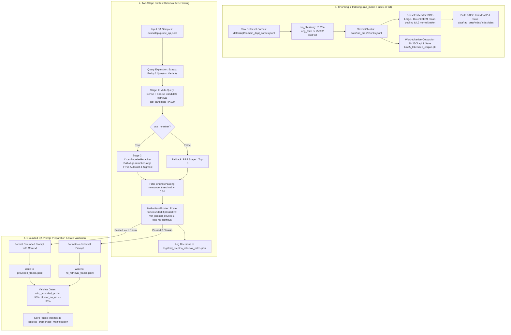

# Step 4: Retrieval-Augmented Distillation Preparation (`lib/s4_rad_prep`)

This module implements **Step 4 (Retrieval-Augmented Distillation Preparation — RAD Prep)** of the Semantics Layer Pipeline. It chunks reference retrieval corpora, builds hybrid dense/sparse vector indices, performs **Two-Stage Hybrid Candidate Retrieval & Cross-Encoder Reranking**, routes QA samples based on similarity thresholding, and prepares grounded QA prompt records with retrieved context for downstream teacher benchmarking and trace generation.

---

## 1. Objectives

- **Sliding-Window Document Chunking**: Partition reference retrieval documents into tokenized sliding-window chunks (512-token chunks with 64-token overlap for long-form texts; 256-token chunks with 32-token overlap for abstracts).
- **Hybrid Vector Indexing**: Generate dense document embeddings using state-of-the-art embedding models (default: **BGE-Large** `BAAI/bge-large-en-v1.5`, with backward compatibility for `michiyasunaga/BioLinkBERT-large` and `microsoft/BiomedNLP-PubMedBERT-base-uncased-abstract`), construct a FAISS inner-product vector index (`IndexFlatIP`), and build a lowercased word-tokenized BM25Okapi sparse index (`bm25_tokenized_corpus.pkl`) for exact-term hybrid search.
- **Smart Query Expansion & Two-Stage Hybrid Retrieval**:
  - **Query Expansion**: Automatically parse quoted biomedical terms (e.g. `"Which definition best describes 'Sulcus'?"` $\rightarrow$ `["Which definition best describes 'Sulcus'?", "Sulcus definition", "Sulcus"]`) to eliminate preamble noise.
  - **Stage 1 (Candidate Pool Fusion)**: Retrieve top candidate pool ($N = 100$, configurable via `RAD_RERANK_CANDIDATE_K`) per query variant combining Dense retrieval (BGE-Large) and Sparse retrieval (BM25Okapi word tokenization) via Reciprocal Rank Fusion (RRF).
  - **Stage 2 (FP16 Cross-Encoder Reranking)**: Re-score query-passage candidate pairs jointly using a **Cross-Encoder Reranker** (default: `BAAI/bge-reranker-large`) accelerated with `torch.cuda.amp.autocast(dtype=torch.float16)` on CUDA, computing normalized sigmoid relevance probabilities in $[0, 1]$.
  - **Stage 3 (Top-K Selection)**: Return top-$k$ (default 7) reranked context chunks.
- **No-Retrieval Sample Routing**: Route QA samples to either grounded or no-retrieval tracks based on similarity thresholding. Samples with fewer than `min_passed_chunks` (default 1) retrieved chunks exceeding `relevance_threshold` (default 0.30 for Cross-Encoder sigmoid probabilities; 0.65 for bi-encoder cosine similarity) are routed to the no-retrieval track.
- **Grounded QA Prompt Preparation**: Assemble grounded QA prompt records (with retrieved context) and no-retrieval QA prompt records, creating datasets for downstream teacher benchmarking and trace generation.
- **Validation Gates & Phase Manifest**: Enforce prompt coverage and cluster retrieval validation gates ($\ge 95\%$ grounded prompts, $\le 30\%$ no-retrieval rate per cluster), outputting a phase manifest (`phase_manifest.json`) and summary log.

---

## 2. Inputs

- **Raw Retrieval Corpus**: `cfg.rad.retrieval_corpus_path` (`data/rad_prep/retrieval_corpus.jsonl` / `data/dapt/domain_dapt_corpus.jsonl`) — Raw reference documents to chunk and index.
- **QA Probe Dataset**: `cfg.rad.qa_samples_path` (`evals/dapt/probe_qa.jsonl`) — Domain QA samples to retrieve context for and format prompts.
- **Embedding Model**: `cfg.rad.embedding_model` (`bge-large` / `BAAI/bge-large-en-v1.5`, `biolinkbert`, `pubmedbert`, or custom HuggingFace model string/path) — Dense feature extractor.
- **Reranker Model**: `cfg.rad.reranker_model` (`BAAI/bge-reranker-large`, `cross-encoder/ms-marco-MiniLM-L-6-v2`, or custom model path) — Cross-Encoder joint sequence classifier.

---

## 3. Outputs

1. **Chunked Corpus**: `cfg.rad.chunks_path` (`data/rad_prep/chunks.jsonl`) — Tokenized text chunks with chunk IDs, doc IDs, doc types, and token counts.
2. **FAISS Vector Index & Metadata**: `cfg.rad.index_dir` (`data/rad_prep/index/`) — `index.faiss` (vector index), `chunks_metadata.jsonl`, `index_manifest.json`, and cached `bm25_tokenized_corpus.pkl` / `json`.
3. **Grounded QA Prompts**: `cfg.rad.traces_dir / "grounded_traces.jsonl"` (`data/rad_prep/traces/grounded_traces.jsonl`) — Grounded QA prompt records incorporating top retrieved context chunks.
4. **No-Retrieval QA Prompts**: `cfg.rad.traces_dir / "no_retrieval_traces.jsonl"` (`data/rad_prep/traces/no_retrieval_traces.jsonl`) — QA prompt records formatted without context grounding.
5. **Phase Logs & Manifest**: Located in `logs/rad_prep/`:
   - `no_retrieval_rates.jsonl` — Sample-by-sample routing decisions and per-cluster rates.
   - `phase_manifest.json` — Phase status (`complete` / `incomplete`), metrics summary, and validation gate pass/fail flags.

---

## 4. Configurations

All parameters are defined in `lib/utils/config.py` under `RADPrepConfig` (`cfg.rad`), fully configurable in `.env.common` and overridable via environment variables:

| Parameter & Environment Variable | Default Value | Description |
| :--- | :---: | :--- |
| `cfg.rad.retrieval_corpus_path` `Env: RAD_CORPUS_PATH` | `data/dapt/` `domain_dapt_corpus.jsonl` | Input raw reference corpus path. |
| `cfg.rad.chunks_path` `Env: RAD_CHUNKS_PATH` | `data/rad_prep/` `chunks.jsonl` | Output path for tokenized sliding-window chunks. |
| `cfg.rad.index_dir` `Env: RAD_INDEX_DIR` | `data/rad_prep/` `index` | Directory for FAISS index, metadata, and BM25 cache. |
| `cfg.rad.traces_dir` `Env: RAD_TRACES_DIR` | `data/rad_prep/` `traces` | Output directory for grounded and no-retrieval QA prompts. |
| `cfg.rad.qa_samples_path` `Env: RAD_QA_SAMPLES_PATH` | `evals/dapt/` `probe_qa.jsonl` | Input QA samples path for prompt preparation. |
| `cfg.rad.embedding_model` `Env: RAD_EMBEDDING_MODEL` | `bge-large` | Dense embedding model key (`bge-large`, `biolinkbert`, `pubmedbert`) or HuggingFace ID. |
| `cfg.rad.retrieval_mode` `Env: RAD_RETRIEVAL_MODE` | `hybrid` | Retrieval engine mode (`dense`, `sparse`, `hybrid`). |
| `cfg.rad.use_reranker` `Env: RAD_USE_RERANKER` | `True` | Toggle Cross-Encoder reranking stage (`True` / `False`). |
| `cfg.rad.reranker_model` `Env: RAD_RERANKER_MODEL` | `BAAI/bge-reranker-large` | Cross-Encoder reranker model key or HuggingFace ID. |
| `cfg.rad.rerank_candidate_k` `Env: RAD_RERANK_CANDIDATE_K` | `100` | Number of candidate chunks retrieved from Stage 1 for Cross-Encoder reranking. |
| `cfg.rad.reranker_batch_size` `Env: RAD_RERANKER_BATCH_SIZE` | `32` | Batch size for Cross-Encoder sequence classification inference. |
| `cfg.rad.query_expansion` `Env: RAD_QUERY_EXPANSION` | `True` | Enable smart entity query variant extraction (`True` / `False`). |
| `cfg.rad.top_k` `Env: RAD_TOP_K` | `7` | Maximum final context chunks returned per query. |
| `cfg.rad.relevance_threshold` `Env: RAD_RELEVANCE_THRESHOLD` | `0.30` | Score threshold for counting passed chunks (0.30 for reranker probabilities; 0.65 for bi-encoder cosine). |
| `cfg.rad.min_passed_chunks` `Env: RAD_MIN_PASSED_CHUNKS` | `1` | Minimum passed chunks required for context grounding. |
| `cfg.rad.embed_batch_size` `Env: RAD_EMBED_BATCH_SIZE` | `256` | Batch size for dense embedding generation. |
| `cfg.rad.long_form_chunk_tokens` `Env: RAD_LONG_FORM_CHUNK_TOKENS` | `512` | Chunk size in tokens for long-form documents. |
| `cfg.rad.long_form_overlap_tokens` `Env: RAD_LONG_FORM_OVERLAP_TOKENS` | `64` | Overlap size in tokens for long-form documents. |
| `cfg.rad.abstract_chunk_tokens` `Env: RAD_ABSTRACT_CHUNK_TOKENS` | `256` | Chunk size in tokens for abstract documents. |
| `cfg.rad.abstract_overlap_tokens` `Env: RAD_ABSTRACT_OVERLAP_TOKENS` | `32` | Overlap size in tokens for abstract documents. |
| `cfg.rad.min_grounded_pct` `Env: RAD_MIN_GROUNDED_PCT` | `0.95` (95%) | Minimum grounded prompt percentage threshold gate. |

---

## 5. List of Modules and their description

### 1. `rad_prep.py` (`run_rad_prep_pipeline`)
- **Role**: Main orchestration entry point for Step 4.
- **Functions & Classes**:
  - `run_rad_prep_pipeline(cfg: PipelineConfig, rad_mode: str = "full")`: Controls execution sub-modes:
    - Mode `"index"`: Executes document chunking (`run_chunking`) and FAISS/BM25 indexing (`run_indexing`).
    - Mode `"prompts"` / `"traces"`: Loads QA samples, performs context retrieval via `Retriever`, routes samples via `NoRetrievalRouter`, formats grounded prompt records via `TraceGenerator`, evaluates validation gates, and writes `phase_manifest.json`.
    - Mode `"full"`: Runs indexing followed by prompt preparation.

### 2. `chunker.py` (`run_chunking`, `chunk_document`, `Chunk`)
- **Role**: Sliding-window document chunking module.

### 3. `indexer.py` (`run_indexing`, `DenseEmbedder`)
- **Role**: Dense embedding generation and FAISS vector index builder.
- **Classes**:
  - `DenseEmbedder(model_key, device)`: Initializes HuggingFace embedding model (`bge-large` -> `BAAI/bge-large-en-v1.5`, `biolinkbert`, `pubmedbert`, or custom path). Supports query instruction prefixing (`"Represent this sentence for searching relevant passages: "`) when embedding queries with BGE models.

### 4. `reranker.py` (`CrossEncoderReranker`) `[NEW]`
- **Role**: Two-Stage Cross-Encoder reranker module.
- **Classes**:
  - `CrossEncoderReranker(model_name, device, batch_size)`: Loads `AutoModelForSequenceClassification` to score query-chunk pairs jointly. Applies mixed-precision FP16 autocast (`torch.cuda.amp.autocast`) on CUDA and sigmoid logit normalization to compute normalized relevance probabilities in $[0, 1]$ for threshold gating.

### 5. `retriever.py` (`Retriever`, `RetrievalResult`, `_extract_query_variants`, `_tokenize_bm25`)
- **Role**: Two-stage hybrid dense/sparse context retrieval engine with dual query expansion.
- **Classes & Helper Functions**:
  - `_extract_query_variants(query)`: Extracts quoted medical terms and entity definitions to eliminate question framing noise.
  - `_tokenize_bm25(text)`: Lowercased word boundary tokenization (`re.findall(r'\w+', text.lower())`) for exact keyword precision.
  - `Retriever(cfg, embedder, reranker)`: Orchestrates multi-stage retrieval:
    - Stage 1: Fetches top candidate pool ($N = 100$) via multi-query RRF of Dense (`bge-large` / FAISS) and Sparse (`BM25Okapi`).
    - Stage 2: Reranks candidate pool using `CrossEncoderReranker` if `cfg.rad.use_reranker` is True (or falls back to Stage 1 RRF if False).
    - Stage 3: Filters chunks against `cfg.rad.relevance_threshold` (calibrated to 0.30 for reranker probabilities) and returns `RetrievalResult`.

### 6. `no_retrieval_router.py` (`NoRetrievalRouter`, `RoutingDecision`)
- **Role**: Sample routing and no-retrieval rate tracking module. Evaluates passed chunks against `min_passed_chunks` (default `1`).

### 7. `trace_generator.py` (`TraceGenerator`, `TeacherModelBackend`, `format_prompt`)
- **Role**: Grounded QA prompt generator and Teacher LLM backend provider for downstream benchmarking.

---

## 6. Overall functional flow of the Step

