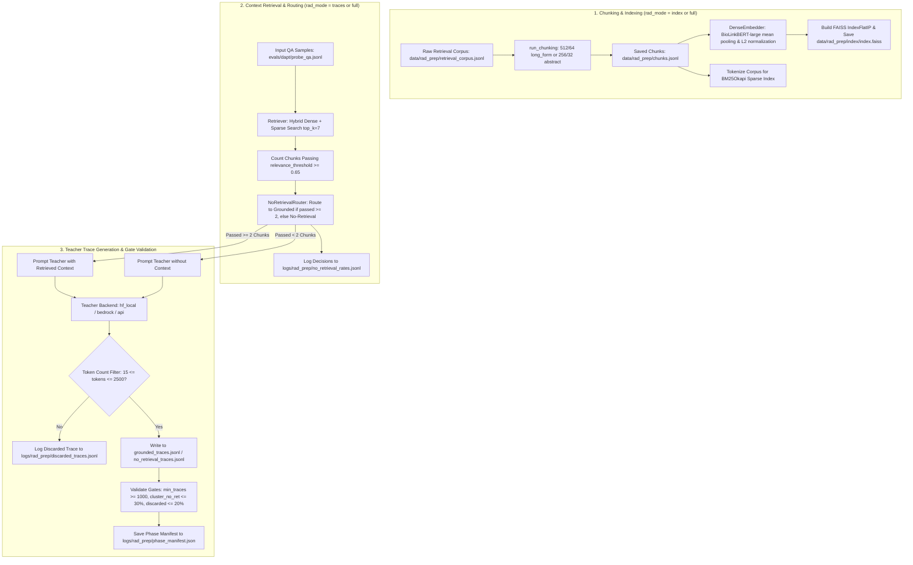

# Step 4: Retrieval-Augmented Distillation Preparation (`lib/s4_rad_prep`)

This module implements **Step 4 (Retrieval-Augmented Distillation Preparation — RAD Prep)** of the Semantics Layer Pipeline. It chunks reference retrieval corpora, builds hybrid dense/sparse vector indices, routes QA samples based on similarity thresholding, generates Chain-of-Thought (CoT) teacher reasoning traces via Teacher LLMs, and validates trace quality gates.

---

## 1. Objectives

- **Sliding-Window Document Chunking**: Partition reference retrieval documents into tokenized sliding-window chunks (512-token chunks with 64-token overlap for long-form texts; 256-token chunks with 32-token overlap for abstracts).
- **Hybrid Vector Indexing**: Generate dense document embeddings using domain models (e.g. `michiyasunaga/BioLinkBERT-large`), construct a FAISS inner-product vector index (`IndexFlatIP`), and build a fast CPU-parallel BM25Okapi sparse tokenized index for hybrid search capability.
- **Hybrid Context Retrieval**: Retrieve top-$k$ (default 7) relevant context chunks per query using hybrid scoring ($0.5 \cdot \text{dense} + 0.5 \cdot \text{sparse}$).
- **No-Retrieval Sample Routing**: Route QA samples to either grounded or no-retrieval tracks based on similarity thresholding. Samples with fewer than 2 retrieved chunks exceeding `relevance_threshold` (default 0.65 cosine similarity) are routed to the no-retrieval track.
- **Teacher Reasoning Trace Generation**: Query Teacher LLMs (supporting `hf_local`, `bedrock`/`aws`, or `api` backends) to generate high-quality Chain-of-Thought (CoT) reasoning traces for both grounded context and no-retrieval samples. Filter out invalid/short traces (<15 tokens or >2500 tokens).
- **Validation Gates & Phase Manifest**: Enforce validation gates ($\ge 1000$ grounded traces, $\le 30\%$ no-retrieval rate per cluster, $\le 20\%$ discarded trace rate), outputting a phase manifest (`phase_manifest.json`) and summary log. Supports execution modes: `index` (chunking & indexing only), `traces` (retrieval & trace generation only), or `full` (end-to-end).

---

## 2. Inputs

- **Raw Retrieval Corpus**: `cfg.rad.retrieval_corpus_path` (`data/rad_prep/retrieval_corpus.jsonl`) — Raw reference documents to chunk and index.
- **QA Probe Dataset**: `cfg.rad.qa_samples_path` (`evals/dapt/probe_qa.jsonl`) — Domain QA samples to retrieve context for and generate reasoning traces.
- **Embedding Model**: `cfg.rad.embedding_model` (`biolinkbert` / `michiyasunaga/BioLinkBERT-large`, `pubmedbert`, etc.) — Dense feature extractor.
- **Teacher LLM Backend**: `cfg.rad.teacher_backend` (`hf_local`, `bedrock`/`aws`, or `api`) with `cfg.rad.teacher_model_name` (e.g. `Qwen/Qwen3-1.7B` or `apac.amazon.nova-pro-v1:0`).

---

## 3. Outputs

1. **Chunked Corpus**: `cfg.rad.chunks_path` (`data/rad_prep/chunks.jsonl`) — Tokenized text chunks with chunk IDs, doc IDs, doc types, and token counts.
2. **FAISS Vector Index & Metadata**: `cfg.rad.index_dir` (`data/rad_prep/index/`) — `index.faiss` (vector index), `chunks_metadata.jsonl`, `index_manifest.json`, and cached `bm25_tokenized_corpus.json`.
3. **Grounded Teacher Traces**: `cfg.rad.traces_dir / "grounded_traces.jsonl"` (`data/rad_prep/traces/grounded_traces.jsonl`) — Grounded CoT reasoning traces incorporating top retrieved context chunks.
4. **No-Retrieval Teacher Traces**: `cfg.rad.traces_dir / "no_retrieval_traces.jsonl"` (`data/rad_prep/traces/no_retrieval_traces.jsonl`) — Teacher reasoning traces generated without context grounding.
5. **Phase Logs & Manifest**: Located in `logs/rad_prep/`:
   - `no_retrieval_rates.jsonl` — Sample-by-sample routing decisions and per-cluster rates.
   - `discarded_traces.jsonl` — Discarded traces failing token boundary constraints.
   - `phase_manifest.json` — Phase status (`complete` / `incomplete`), metrics summary, and validation gate pass/fail flags.

---

## 4. Configurations

All parameters are defined in `lib/utils/config.py` under `RADPrepConfig` (`cfg.rad`), overridable via environment variables:

| Parameter & Environment Variable | Default Value | Description |
| :--- | :---: | :--- |
| `cfg.rad.retrieval_corpus_path` `Env: RAD_CORPUS_PATH` | `data/rad_prep/` `retrieval_corpus.jsonl` | Input raw reference corpus path. |
| `cfg.rad.chunks_path` `Env: RAD_CHUNKS_PATH` | `data/rad_prep/` `chunks.jsonl` | Output path for tokenized sliding-window chunks. |
| `cfg.rad.index_dir` `Env: RAD_INDEX_DIR` | `data/rad_prep/` `index` | Directory for FAISS index, metadata, and BM25 cache. |
| `cfg.rad.traces_dir` `Env: RAD_TRACES_DIR` | `data/rad_prep/` `traces` | Output directory for grounded and no-retrieval traces. |
| `cfg.rad.qa_samples_path` `Env: RAD_QA_SAMPLES_PATH` | `evals/dapt/` `probe_qa.jsonl` | Input QA samples path for trace generation. |
| `cfg.rad.embedding_model` `Env: RAD_EMBEDDING_MODEL` | `biolinkbert` | Dense embedding model key or HuggingFace ID. |
| `cfg.rad.retrieval_mode` `Env: RAD_RETRIEVAL_MODE` | `hybrid` | Retrieval engine mode (`dense`, `sparse`, `hybrid`). |
| `cfg.rad.top_k` `Env: RAD_TOP_K` | `7` | Maximum context chunks retrieved per query. |
| `cfg.rad.relevance_threshold` `Env: RAD_RELEVANCE_THRESHOLD` | `0.65` | Cosine similarity threshold for counting passed chunks. |
| `cfg.rad.embed_batch_size` `Env: RAD_EMBED_BATCH_SIZE` | `256` | GPU VRAM batch size for dense embedding. |
| `cfg.rad.long_form_chunk_tokens` `Env: RAD_LONG_FORM_CHUNK_TOKENS` | `512` | Chunk size in tokens for long-form documents. |
| `cfg.rad.long_form_overlap_tokens` `Env: RAD_LONG_FORM_OVERLAP_TOKENS` | `64` | Overlap size in tokens for long-form documents. |
| `cfg.rad.abstract_chunk_tokens` `Env: RAD_ABSTRACT_CHUNK_TOKENS` | `256` | Chunk size in tokens for abstract documents. |
| `cfg.rad.abstract_overlap_tokens` `Env: RAD_ABSTRACT_OVERLAP_TOKENS` | `32` | Overlap size in tokens for abstract documents. |
| `cfg.rad.teacher_backend` `Env: RAD_TEACHER_BACKEND` | `hf_local` | Teacher LLM provider backend (`hf_local`, `bedrock`, `api`). |
| `cfg.rad.teacher_model_name` `Env: RAD_TEACHER_MODEL_NAME` | `Qwen/` `Qwen3-1.7B` | Target teacher model identifier or local path. |
| `cfg.rad.teacher_batch_size` `Env: RAD_TEACHER_BATCH_SIZE` | `16` | Concurrent worker threads or batch size for trace generation. |
| `cfg.rad.trace_min_tokens` `Env: RAD_TRACE_MIN_TOKENS` | `15` | Minimum token length threshold for retaining traces. |
| `cfg.rad.trace_max_tokens` `Env: RAD_TRACE_MAX_TOKENS` | `2500` | Maximum token length threshold for retaining traces. |
| `cfg.rad.min_traces` `Env: RAD_MIN_TRACES` | `1000` | Minimum grounded trace count gate. |

---

## 5. List of Modules and their description

### 1. `rad_prep.py` (`run_rad_prep_pipeline`)
- **Role**: Main orchestration entry point for Step 4.
- **Functions & Classes**:
  - `run_rad_prep_pipeline(cfg: PipelineConfig, rad_mode: str = "full")`: Controls execution sub-modes:
    - Mode `"index"`: Executes document chunking (`run_chunking`) and FAISS/BM25 indexing (`run_indexing`).
    - Mode `"traces"`: Loads QA samples, performs context retrieval via `Retriever`, routes samples via `NoRetrievalRouter`, generates CoT traces via `TraceGenerator`, evaluates validation gates, and writes `phase_manifest.json`.
    - Mode `"full"`: Runs indexing followed by trace generation.

### 2. `chunker.py` (`run_chunking`, `chunk_document`, `Chunk`)
- **Role**: Sliding-window document chunking module.
- **Functions & Classes**:
  - `Chunk`: Dataclass storing `chunk_id`, `doc_id`, `doc_type`, `text`, and `token_count`.
  - `chunk_document(doc_id, text, doc_type, tokenizer, chunk_size, overlap_size)`: Tokenizes text into chunks with specified token length and overlap.
  - `run_chunking(cfg: PipelineConfig)`: Reads `cfg.rad.retrieval_corpus_path`, applies `long_form` (512/64) or `abstract` (256/32) chunking parameters, and saves JSONL records to `cfg.rad.chunks_path`.

### 3. `indexer.py` (`run_indexing`, `DenseEmbedder`)
- **Role**: Dense embedding generation and FAISS vector index builder.
- **Functions & Classes**:
  - `DenseEmbedder(model_key, device)`: Loads domain transformer models (`michiyasunaga/BioLinkBERT-large`, `microsoft/BiomedNLP-PubMedBERT-base-uncased-abstract`, etc.). Computes mean-pooled, L2-normalized dense embeddings in VRAM batches (`embed_batch_size=256`).
  - `run_indexing(cfg: PipelineConfig, chunks)`: Computes embeddings for all chunks, constructs a FAISS inner-product vector index (`faiss.IndexFlatIP`), saves `index.faiss`, `chunks_metadata.jsonl`, and `index_manifest.json`.

### 4. `retriever.py` (`Retriever`, `RetrievalResult`)
- **Role**: Hybrid dense/sparse context retrieval engine.
- **Functions & Classes**:
  - `RetrievalResult`: Dataclass containing `chunks`, `scores`, `passed_threshold` count, and `retrieval_mode`.
  - `Retriever(cfg, embedder)`: Loads chunks, FAISS vector index, and BM25Okapi index (using CPU-parallel tokenizer batch caching).
    - `_retrieve_dense(query, top_k)`: Embeds query and runs FAISS inner-product search.
    - `_retrieve_sparse(query, top_k)`: Tokenizes query and runs BM25 similarity scoring.
    - `_retrieve_hybrid(query, top_k)`: Combines normalized dense and sparse scores with equal weighting ($0.5 \cdot \text{dense} + 0.5 \cdot \text{sparse}$).
    - `retrieve(query)`: Executes retrieval, counts chunks passing `relevance_threshold` (default 0.65), and returns `RetrievalResult`.

### 5. `no_retrieval_router.py` (`NoRetrievalRouter`, `RoutingDecision`)
- **Role**: Sample routing and no-retrieval rate tracking module.
- **Functions & Classes**:
  - `RoutingDecision`: Dataclass storing `sample_id`, `cluster_id`, `no_retrieval` flag, `passed_chunks` count, and `reason`.
  - `NoRetrievalRouter`: Evaluates whether a sample has $\ge 2$ retrieved context chunks passing the similarity threshold. If `passed_chunks < 2`, routes to the no-retrieval track. Logs decisions to `no_retrieval_rates.jsonl` and computes aggregate statistics (overall and per-cluster no-retrieval rates).

### 6. `trace_generator.py` (`TraceGenerator`, `TeacherModelBackend`)
- **Role**: Multi-backend Teacher LLM CoT trace generation engine.
- **Functions & Classes**:
  - `TraceRecord`: Dataclass storing generated trace metadata (`sample_id`, `cluster_id`, `question`, `answer`, `retrieved_context`, `no_retrieval`, `teacher_trace`, `token_count`, `teacher_model`, `embedding_model`).
  - `TeacherModelBackend`: Abstract base class for teacher backends.
  - `LocalHFBackend`: Generates traces locally using HuggingFace `AutoModelForCausalLM` (`Qwen/Qwen3-1.7B`).
  - `APIBackend`: Generates traces via HTTP requests to OpenAI-compatible REST API endpoints.
  - `TraceGenerator(cfg)`: Formats grounded prompts (query + retrieved context) or no-retrieval prompts, queries the teacher backend, enforces min/max token length boundaries (`trace_min_tokens=15`, `trace_max_tokens=2500`), logs discarded traces to `discarded_traces.jsonl`, and streams valid trace records to `grounded_traces.jsonl` and `no_retrieval_traces.jsonl`.

### 7. `__init__.py`
- **Role**: Public API exports for `lib.s4_rad_prep`.
- **Exports**: `run_rad_prep_pipeline`.

---

## 6. Overall functional flow of the Step

### Detailed Functional Walkthrough

1. **Sliding-Window Document Chunking**: `run_chunking` reads `data/rad_prep/retrieval_corpus.jsonl`. Documents marked as `long_form` are chunked into 512-token segments with 64-token overlap; `abstract` documents are chunked into 256-token segments with 32-token overlap. Outputs tokenized chunks to `data/rad_prep/chunks.jsonl`.
2. **Dense & Sparse Indexing**: `run_indexing` loads `DenseEmbedder` (`michiyasunaga/BioLinkBERT-large`), computes mean-pooled L2-normalized embeddings in GPU VRAM batches (`embed_batch_size=256`), and constructs a FAISS inner-product vector index saved to `index.faiss`. Simultaneously, `Retriever` tokenizes chunks to build a cached `BM25Okapi` index for sparse keyword matching.
3. **Hybrid Context Retrieval**: For each QA sample in `evals/dapt/probe_qa.jsonl`, `Retriever` executes hybrid search ($0.5 \cdot \text{FAISS} + 0.5 \cdot \text{BM25}$), returning the top-$k$ (default 7) context chunks. It computes cosine similarity scores and counts how many chunks exceed `relevance_threshold` (default 0.65).
4. **No-Retrieval Sample Routing**: `NoRetrievalRouter` evaluates the passed chunk count. If `passed_chunks >= 2`, the sample is routed to the grounded trace track; if `passed_chunks < 2`, it is routed to the no-retrieval track. Decisions are logged to `no_retrieval_rates.jsonl`.
5. **Teacher Reasoning Trace Generation**: `TraceGenerator` formats prompts (incorporating top retrieved context for grounded samples) and queries the designated Teacher LLM backend (`hf_local`, `bedrock`, or `api`).
6. **Trace Quality Filtering & Gate Verification**: Generated CoT traces are tokenized. Traces shorter than `trace_min_tokens` (15 tokens) or longer than `trace_max_tokens` (2500 tokens) are logged to `discarded_traces.jsonl`. Valid traces are saved to `grounded_traces.jsonl` or `no_retrieval_traces.jsonl`. Finally, `run_rad_prep_pipeline` evaluates phase validation gates ($\ge 1000$ grounded traces, $\le 30\%$ no-retrieval rate per cluster, $\le 20\%$ discarded rate) and outputs `phase_manifest.json`.
