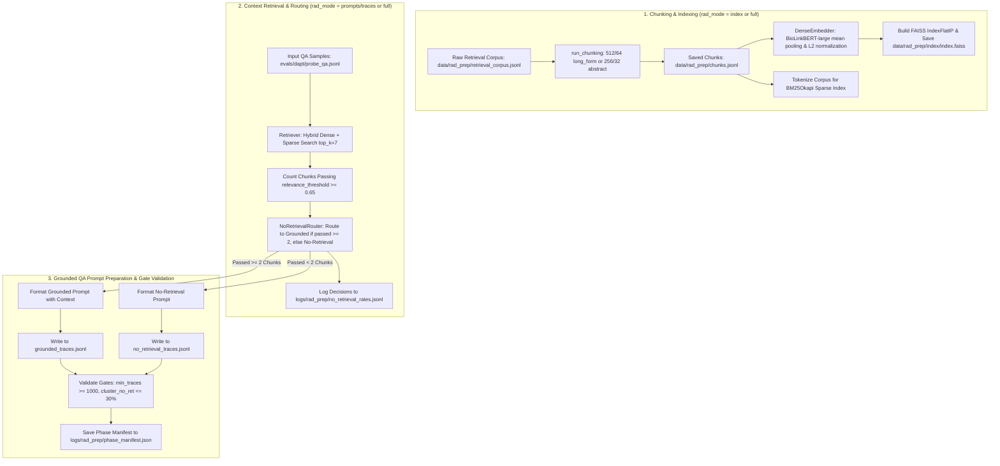

# Step 4: Retrieval-Augmented Distillation Preparation (`lib/s4_rad_prep`)

This module implements **Step 4 (Retrieval-Augmented Distillation Preparation — RAD Prep)** of the Semantics Layer Pipeline. It chunks reference retrieval corpora, builds hybrid dense/sparse vector indices, routes QA samples based on similarity thresholding, and prepares grounded QA prompt records with retrieved context for downstream teacher benchmarking and trace generation.

---

## 1. Objectives

- **Sliding-Window Document Chunking**: Partition reference retrieval documents into tokenized sliding-window chunks (512-token chunks with 64-token overlap for long-form texts; 256-token chunks with 32-token overlap for abstracts).
- **Hybrid Vector Indexing**: Generate dense document embeddings using domain models (e.g. `michiyasunaga/BioLinkBERT-large`), construct a FAISS inner-product vector index (`IndexFlatIP`), and build a fast CPU-parallel BM25Okapi sparse tokenized index for hybrid search capability.
- **Hybrid Context Retrieval**: Retrieve top-$k$ (default 7) relevant context chunks per query using hybrid scoring ($0.5 \cdot \text{dense} + 0.5 \cdot \text{sparse}$).
- **No-Retrieval Sample Routing**: Route QA samples to either grounded or no-retrieval tracks based on similarity thresholding. Samples with fewer than 2 retrieved chunks exceeding `relevance_threshold` (default 0.65 cosine similarity) are routed to the no-retrieval track.
- **Grounded QA Prompt Preparation**: Assemble grounded QA prompt records (with retrieved context) and no-retrieval QA prompt records, creating datasets for downstream teacher benchmarking and trace generation.
- **Validation Gates & Phase Manifest**: Enforce prompt coverage and cluster retrieval validation gates ($\ge 1000$ grounded prompts, $\le 30\%$ no-retrieval rate per cluster), outputting a phase manifest (`phase_manifest.json`) and summary log. Supports execution modes: `index` (chunking & indexing only), `prompts` / `traces` (retrieval & prompt preparation only), or `full` (end-to-end).

---

## 2. Inputs

- **Raw Retrieval Corpus**: `cfg.rad.retrieval_corpus_path` (`data/rad_prep/retrieval_corpus.jsonl`) — Raw reference documents to chunk and index.
- **QA Probe Dataset**: `cfg.rad.qa_samples_path` (`evals/dapt/probe_qa.jsonl`) — Domain QA samples to retrieve context for and format prompts.
- **Embedding Model**: `cfg.rad.embedding_model` (`biolinkbert` / `michiyasunaga/BioLinkBERT-large`, `pubmedbert`, etc.) — Dense feature extractor.

---

## 3. Outputs

1. **Chunked Corpus**: `cfg.rad.chunks_path` (`data/rad_prep/chunks.jsonl`) — Tokenized text chunks with chunk IDs, doc IDs, doc types, and token counts.
2. **FAISS Vector Index & Metadata**: `cfg.rad.index_dir` (`data/rad_prep/index/`) — `index.faiss` (vector index), `chunks_metadata.jsonl`, `index_manifest.json`, and cached `bm25_tokenized_corpus.json`.
3. **Grounded QA Prompts**: `cfg.rad.traces_dir / "grounded_traces.jsonl"` (`data/rad_prep/traces/grounded_traces.jsonl`) — Grounded QA prompt records incorporating top retrieved context chunks.
4. **No-Retrieval QA Prompts**: `cfg.rad.traces_dir / "no_retrieval_traces.jsonl"` (`data/rad_prep/traces/no_retrieval_traces.jsonl`) — QA prompt records formatted without context grounding.
5. **Phase Logs & Manifest**: Located in `logs/rad_prep/`:
   - `no_retrieval_rates.jsonl` — Sample-by-sample routing decisions and per-cluster rates.
   - `phase_manifest.json` — Phase status (`complete` / `incomplete`), metrics summary, and validation gate pass/fail flags.

---

## 4. Configurations

All parameters are defined in `lib/utils/config.py` under `RADPrepConfig` (`cfg.rad`), overridable via environment variables:

| Parameter & Environment Variable | Default Value | Description |
| :--- | :---: | :--- |
| `cfg.rad.retrieval_corpus_path` `Env: RAD_CORPUS_PATH` | `data/rad_prep/` `retrieval_corpus.jsonl` | Input raw reference corpus path. |
| `cfg.rad.chunks_path` `Env: RAD_CHUNKS_PATH` | `data/rad_prep/` `chunks.jsonl` | Output path for tokenized sliding-window chunks. |
| `cfg.rad.index_dir` `Env: RAD_INDEX_DIR` | `data/rad_prep/` `index` | Directory for FAISS index, metadata, and BM25 cache. |
| `cfg.rad.traces_dir` `Env: RAD_TRACES_DIR` | `data/rad_prep/` `traces` | Output directory for grounded and no-retrieval QA prompts. |
| `cfg.rad.qa_samples_path` `Env: RAD_QA_SAMPLES_PATH` | `evals/dapt/` `probe_qa.jsonl` | Input QA samples path for prompt preparation. |
| `cfg.rad.embedding_model` `Env: RAD_EMBEDDING_MODEL` | `biolinkbert` | Dense embedding model key or HuggingFace ID. |
| `cfg.rad.retrieval_mode` `Env: RAD_RETRIEVAL_MODE` | `hybrid` | Retrieval engine mode (`dense`, `sparse`, `hybrid`). |
| `cfg.rad.top_k` `Env: RAD_TOP_K` | `7` | Maximum context chunks retrieved per query. |
| `cfg.rad.relevance_threshold` `Env: RAD_RELEVANCE_THRESHOLD` | `0.65` | Cosine similarity threshold for counting passed chunks. |
| `cfg.rad.embed_batch_size` `Env: RAD_EMBED_BATCH_SIZE` | `256` | GPU VRAM batch size for dense embedding. |
| `cfg.rad.long_form_chunk_tokens` `Env: RAD_LONG_FORM_CHUNK_TOKENS` | `512` | Chunk size in tokens for long-form documents. |
| `cfg.rad.long_form_overlap_tokens` `Env: RAD_LONG_FORM_OVERLAP_TOKENS` | `64` | Overlap size in tokens for long-form documents. |
| `cfg.rad.abstract_chunk_tokens` `Env: RAD_ABSTRACT_CHUNK_TOKENS` | `256` | Chunk size in tokens for abstract documents. |
| `cfg.rad.abstract_overlap_tokens` `Env: RAD_ABSTRACT_OVERLAP_TOKENS` | `32` | Overlap size in tokens for abstract documents. |

---

## 5. List of Modules and their description

### 1. `rad_prep.py` (`run_rad_prep_pipeline`)
- **Role**: Main orchestration entry point for Step 4.
- **Functions & Classes**:
  - `run_rad_prep_pipeline(cfg: PipelineConfig, rad_mode: str = "full")`: Controls execution sub-modes:
    - Mode `"index"`: Executes document chunking (`run_chunking`) and FAISS/BM25 indexing (`run_indexing`).
    - Mode `"prompts"` / `"traces"`: Loads QA samples, performs context retrieval via `Retriever`, routes samples via `NoRetrievalRouter`, formats grounded prompt records via `TraceGenerator`, evaluates validation gates, and writes `phase_manifest.json`.
    - Mode `"full"`: Runs indexing followed by prompt preparation.

### 2. `chunker.py` (`run_chunking`, `chunk_document`, `Chunk`)
- **Role**: Sliding-window document chunking module.

### 3. `indexer.py` (`run_indexing`, `DenseEmbedder`)
- **Role**: Dense embedding generation and FAISS vector index builder.

### 4. `retriever.py` (`Retriever`, `RetrievalResult`)
- **Role**: Hybrid dense/sparse context retrieval engine.

### 5. `no_retrieval_router.py` (`NoRetrievalRouter`, `RoutingDecision`)
- **Role**: Sample routing and no-retrieval rate tracking module.

### 6. `trace_generator.py` (`TraceGenerator`, `TeacherModelBackend`, `format_prompt`)
- **Role**: Grounded QA prompt generator and Teacher LLM backend provider for downstream benchmarking.
- **Functions & Classes**:
  - `TraceRecord`: Dataclass storing prompt record metadata (`sample_id`, `cluster_id`, `question`, `answer`, `retrieved_context`, `no_retrieval`, `embedding_model`).
  - `TeacherModelBackend`, `LocalHFBackend`, `APIBackend`, `BedrockBackend`: Preserved abstractions for candidate teacher benchmarking in `s6` and post-`s6` trace generation.
  - `format_prompt(question, answer, context_chunks, no_retrieval)`: Formats grounded prompts with `[CONTEXT]`, `[QUESTION]`, `[GROUND TRUTH]`, or `[NO CONTEXT AVAILABLE]`.
  - `TraceGenerator(cfg)`: Formats grounded prompts (query + retrieved context) or no-retrieval prompts, and streams prompt records to `grounded_traces.jsonl` and `no_retrieval_traces.jsonl`.

---

## 6. Overall functional flow of the Step

