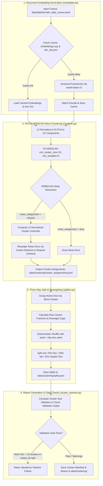

# Step 5: Corpus Engineering & Micro-Clustering (`lib/s5_clustering`)

This module implements **Step 5 (Corpus Engineering & Micro-Clustering)** of the Semantics Layer Pipeline. It generates dense document embeddings, applies PCA dimensionality reduction, runs HDBSCAN micro-clustering to discover latent neuroscience domains, reassigns noise points to nearest centroids, calculates imbalance reweighting caps, partitions per-cluster datasets into a three-way split (dev/val/sealed), and validates cluster quality gates.

---

## 1. Objectives

- **Dense Document Embedding Generation**: Embed all documents in the unified DAPT corpus using a sentence transformer model (`all-mpnet-base-v2`). Cache embeddings and document ID lists (`embeddings.npy`, `doc_ids.json`) to disk to bypass re-computation.
- **PCA Dimensionality Reduction**: Apply Principal Component Analysis (PCA) to reduce high-dimensional embeddings down to 10 components (when `use_pca=True`), preventing high-dimensional distance concentration before clustering.
- **Latent Micro-Clustering**: Run HDBSCAN density-based clustering to automatically discover latent neuroscience sub-domains (micro-clusters) without hardcoding cluster counts.
- **Noise Point Centroid Resolution**: Reassign unclustered noise documents (originally labeled `-1` by HDBSCAN) to their nearest active cluster centroid via cosine distance similarity when `noise_assignment="nearest"`.
- **Three-Way Dataset Partitioning**: Partition documents within each micro-cluster into a deterministic three-way split (70% development / 20% validation / 10% sealed test) using a fixed random seed (`cfg.misc.seed`).
- **Cluster Reweighting & Quality Gating**: Calculate per-cluster raw dataset fractions and reweighting caps (`cluster_min_fraction = 0.02`, `cluster_max_fraction = 0.15`). Enforce validation quality gates ($\ge 10$ clusters, noise fraction $\le 30\%$, largest cluster fraction $\le 40\%$, no empty validation split).

---

## 2. Inputs

- **Unified Domain Corpus**: `cfg.clustering.corpus_path` (`data/dapt/domain_dapt_corpus.jsonl`) — Clean JSONL pretraining corpus output by Step 1.
- **Sentence Transformer Model**: `cfg.clustering.embedding_model` (`all-mpnet-base-v2`) — Pretrained sentence-transformer embedding model.
- **Random Seed**: `cfg.misc.seed` (default 42) — Ensures deterministic PCA reduction and train/val/sealed document splitting.

---

## 3. Outputs

1. **Cluster Assignments**: `cfg.clustering.assignments_path` (`data/clustering/cluster_assignments.jsonl`) — Line-delimited JSON recording `doc_id`, `cluster_id`, `cluster_label` (`cluster_000`, `cluster_001`, ...), `is_noise`, and `assigned_by` (`hdbscan` or `nearest_centroid`).
2. **Three-Way Dataset Splits**: `cfg.clustering.splits_path` (`data/clustering/splits.json`) — JSON file containing `dev_doc_ids`, `val_doc_ids`, `sealed_doc_ids`, `raw_fraction`, and `reweight_cap` for every micro-cluster.
3. **Cluster Manifest**: `cfg.clustering.cluster_manifest_path` (`data/clustering/cluster_manifest.json`) — Manifest recording execution status (`complete` / `failed`), embedding model, noise statistics, cluster size metrics (min/max/mean/median/std), and warning messages.
4. **Cluster Statistics Report**: `cfg.clustering.cluster_report_path` (`logs/clustering/cluster_report.json`) — Summary report detailing document counts, raw dataset fractions, and reweighting caps per micro-cluster.
5. **Embeddings & Document ID Cache**: `cfg.clustering.embeddings_cache_path` (`data/clustering/embeddings.npy`) and `doc_ids_cache_path` (`data/clustering/doc_ids.json`) — Cached numpy array and ID mapping.

---

## 4. Configurations

All parameters are defined in `lib/utils/config.py` under `ClusteringConfig` (`cfg.clustering`), overridable via environment variables:

| Parameter & Environment Variable | Default Value | Description |
| :--- | :---: | :--- |
| `cfg.clustering.corpus_path` `Env: CLUSTERING_CORPUS_PATH` | `data/dapt/` `domain_dapt_corpus.jsonl` | Input domain corpus path. |
| `cfg.clustering.embedding_model` `Env: CLUSTERING_EMBEDDING_MODEL` | `all-mpnet-base-v2` | SentenceTransformer model ID. |
| `cfg.clustering.embed_batch_size` `Env: CLUSTERING_EMBED_BATCH_SIZE` | `64` | Batch size for document embedding generation. |
| `cfg.clustering.embeddings_cache_path` `Env: CLUSTERING_EMBEDDINGS_CACHE` | `data/clustering/` `embeddings.npy` | Cache path for dense embedding NumPy array. |
| `cfg.clustering.doc_ids_cache_path` `Env: CLUSTERING_DOC_IDS_CACHE` | `data/clustering/` `doc_ids.json` | Cache path for document ID list. |
| `cfg.clustering.hdbscan_min_cluster_size` `Env: HDBSCAN_MIN_CLUSTER_SIZE` | `6` | Minimum cluster size parameter for HDBSCAN. |
| `cfg.clustering.hdbscan_min_samples` `Env: HDBSCAN_MIN_SAMPLES` | `1` | Minimum samples parameter for HDBSCAN. |
| `cfg.clustering.hdbscan_metric` `Env: HDBSCAN_METRIC` | `cosine` | Metric used for HDBSCAN distance calculation. |
| `cfg.clustering.min_clusters` `Env: CLUSTERING_MIN_CLUSTERS` | `10` | Hard failure threshold for minimum cluster count. |
| `cfg.clustering.use_pca` `Env: CLUSTERING_USE_PCA` | `True` | Enable PCA dimensionality reduction before HDBSCAN. |
| `cfg.clustering.pca_components` `Env: CLUSTERING_PCA_COMPONENTS` | `20` | Target PCA components count. |
| `cfg.clustering.noise_assignment` `Env: CLUSTERING_NOISE_ASSIGNMENT` | `nearest` | Strategy for noise points (`nearest` centroid or `drop`). |
| `cfg.clustering.cluster_min_fraction` `Env: CLUSTER_MIN_FRACTION` | `0.02` | Minimum desired raw fraction threshold for reweight capping. |
| `cfg.clustering.cluster_max_fraction` `Env: CLUSTER_MAX_FRACTION` | `0.15` | Maximum desired raw fraction threshold for reweight capping. |
| `cfg.clustering.split_dev_ratio` `Env: SPLIT_DEV_RATIO` | `0.70` | Ratio of cluster documents allocated to development set. |
| `cfg.clustering.split_val_ratio` `Env: SPLIT_VAL_RATIO` | `0.20` | Ratio of cluster documents allocated to validation set. |
| `cfg.clustering.split_sealed_ratio` `Env: SPLIT_SEALED_RATIO` | `0.10` | Ratio of cluster documents allocated to sealed test set. |

---

## 5. List of Modules and their description

### 1. `clustering.py` (`run_clustering_pipeline`)
- **Role**: Pipeline orchestrator for Step 5.
- **Functions & Classes**:
  - `run_clustering_pipeline(cfg: PipelineConfig)`: Creates target output directories, invokes `run_embedding`, runs HDBSCAN via `run_clustering`, writes `cluster_assignments.jsonl`, partitions datasets via `run_splitting`, writes `splits.json`, and invokes `run_reporting` to validate gates and produce manifests.

### 2. `embedder.py` (`run_embedding`, `load_corpus`)
- **Role**: SentenceTransformer document embedding and disk caching module.
- **Functions & Classes**:
  - `load_corpus(corpus_path)`: Reads input JSONL file and yields `(doc_id, text)` tuples.
  - `run_embedding(cfg: PipelineConfig)`: Checks `embeddings.npy` and `doc_ids.json` cache files. On cache hit (matching document count and model ID), loads cached embeddings. On cache miss, encodes texts using `SentenceTransformer(cfg.clustering.embedding_model)` with batch size 64, displaying a progress bar, and saves results to disk.

### 3. `clusterer.py` (`run_clustering`, `ClusterAssignment`)
- **Role**: PCA reduction, HDBSCAN density clustering, and nearest-centroid noise resolution engine.
- **Functions & Classes**:
  - `ClusterAssignment`: Dataclass storing `doc_id`, `cluster_id`, `cluster_label` (`cluster_000`, `cluster_001`, ...), `is_noise`, and `assigned_by` (`hdbscan`, `nearest_centroid`, or `dropped`).
  - `run_clustering(cfg: PipelineConfig, embeddings, doc_ids)`:
    - Normalizes embeddings, fits PCA (`pca_components=10`), and re-normalizes reduced vectors.
    - Fits HDBSCAN (`min_cluster_size=10`, `min_samples=5`).
    - Resolves noise points (labeled `-1`): computes mean L2-normalized centroids for each active cluster, calculates cosine similarity dot products between noise vectors and centroids, and reassigns noise points to their nearest cluster centroid.

### 4. `splitter.py` (`run_splitting`, `ClusterSplit`)
- **Role**: Per-cluster three-way dataset partitioner and imbalance reweighting calculator.
- **Functions & Classes**:
  - `ClusterSplit`: Dataclass storing `cluster_id`, `cluster_label`, `dev_doc_ids`, `val_doc_ids`, `sealed_doc_ids`, `total_docs`, `raw_fraction`, and `reweight_cap`.
  - `run_splitting(cfg: PipelineConfig, assignments)`: Groups active documents by micro-cluster. Computes raw dataset fractions. Calculates `reweight_cap` recommendations if a cluster fraction is $< 0.02$ or $> 0.15$. Shuffles document IDs deterministically using `cfg.misc.seed` and partitions documents into 70% dev / 20% val / 10% sealed test sets (enforcing $\ge 1$ validation document for clusters with $\ge 3$ documents).

### 5. `cluster_reporter.py` (`run_reporting`)
- **Role**: Cluster quality reporter and validation gate checker.
- **Functions & Classes**:
  - `run_reporting(cfg, assignments, splits_data)`: Computes statistical metrics (min, max, mean, median, std of cluster sizes), checks noise fraction and imbalance caps, enforces validation gate criteria (hard failure if total clusters $< 10$ or validation split is empty; warning if clusters $< 50$, noise $> 30\%$, or largest cluster $> 40\%$), and writes `cluster_manifest.json` and `cluster_report.json`.

### 6. `__init__.py`
- **Role**: Public API exports for `lib.s5_clustering`.
- **Exports**: `run_clustering_pipeline`.

---

## 6. Overall functional flow of the Step

### Detailed Functional Walkthrough

1. **Document Ingestion & Embedding Cache Check**: `run_embedding` loads document IDs and text records from `data/dapt/domain_dapt_corpus.jsonl`. It inspects `embeddings.npy` and `doc_ids.json`. If document counts and embedding model names match, it loads the cached array. Otherwise, it encodes document texts using `SentenceTransformer("all-mpnet-base-v2")` with batch size 64 and writes the cache.
2. **PCA Reduction & HDBSCAN Clustering**: `run_clustering` normalizes original embeddings and applies PCA dimensionality reduction to 10 components (`pca_components=10`). It fits HDBSCAN (`min_cluster_size=10`, `min_samples=5`), discovering latent neuroscience micro-clusters.
3. **Noise Point Centroid Resolution**: For documents originally tagged as noise (`-1`), `clusterer.py` calculates L2-normalized mean centroids for all active clusters. It computes cosine similarity dot products between each noise vector and all cluster centroids, reassigning noise documents to their closest matching cluster centroid. Outputs `cluster_assignments.jsonl`.
4. **Per-Cluster Dataset Splitting & Reweighting**: `run_splitting` processes each micro-cluster independently. It calculates raw dataset fractions and reweighting caps (`reweight_cap` recommended if fraction $< 0.02$ or $> 0.15$). It shuffles document IDs deterministically (`cfg.misc.seed`) and partitions them into a three-way split (70% dev / 20% val / 10% sealed test), saving `splits.json`.
5. **Validation Gating & Manifest Reporting**: `run_reporting` computes cluster size summary statistics (min, max, mean, median, std). It checks validation gates: hard fails if cluster count is $< 10$ or any validation split is empty; warns if noise exceeds 30% or the largest cluster exceeds 40%. Saves `cluster_manifest.json` and `cluster_report.json`.
