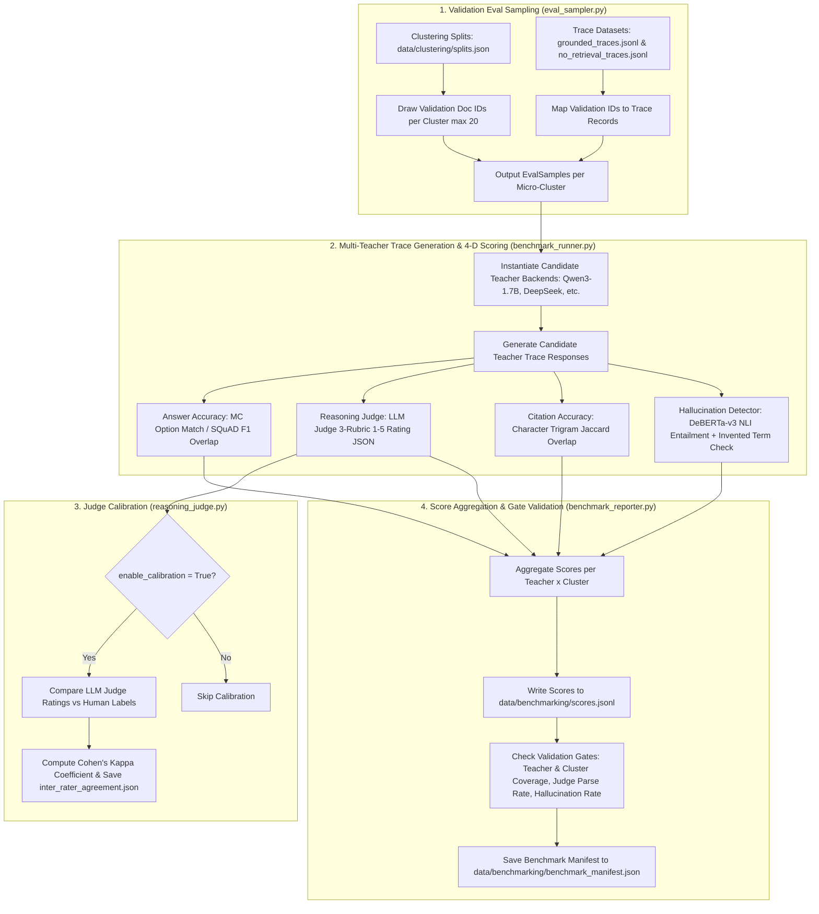

# Step 6: Teacher Benchmarking (`lib/s6_teacher_benchmarking`)

This module implements **Step 6 (Teacher Benchmarking)** of the Semantics Layer Pipeline. It samples validation items across micro-clusters, evaluates candidate Teacher LLMs across four scoring dimensions (answer accuracy, reasoning quality via LLM judge, citation accuracy, and hallucination rate via NLI), calculates inter-rater Cohen's Kappa calibration against human labels, aggregates per-teacher $\times$ cluster scores, and validates benchmark quality gates.

---

## 1. Objectives

- **Multi-Teacher Candidate Evaluation**: Evaluate candidate Teacher LLMs (`Qwen/Qwen3-1.7B`, `DeepSeek`, etc.) across each micro-cluster discovered in Step 5 (`lib/s5_clustering`).
- **Validation Eval Sampling**: Draw evaluation samples (`EvalSample`) from cluster validation splits (`splits.json`) and map them to their corresponding grounded or no-retrieval trace records from Step 4 (`lib/s4_rad_prep`).
- **Four-Dimensional Scoring**: Score candidate teacher responses across four evaluation dimensions:
  1. **Answer Accuracy**: Multiple-choice option matching or free-form SQuAD-style token F1 overlap against ground truth.
  2. **Reasoning Quality**: LLM Judge rubric rating three components from 1–5 (step validity, logical coherence, absence of circular reasoning), normalized to $[0, 1]$.
  3. **Citation Accuracy**: Character-level Jaccard similarity between trace citations/reference phrases and retrieved context chunks (precision, recall, F1).
  4. **Hallucination Detection**: Two-pass NLI cross-encoder entailment checking + domain terminology sanity checking.
- **Judge Calibration & Cohen's Kappa**: Compute Cohen's Kappa coefficient ($\kappa$) to measure inter-rater agreement between LLM Judge ratings and human labels when calibration data is provided (`enable_calibration=True`).
- **Per-Cluster Teacher Score Logging & Gating**: Aggregate per-sample scores into per-teacher $\times$ cluster metrics (`scores.jsonl`) and validate pipeline quality gates (all candidate teachers evaluated across all micro-clusters, LLM judge response parse failures $\le 5\%$, overall hallucination rate $\le 25\%$).

---

## 2. Inputs

- **Cluster Splits & Manifests**: `cfg.clustering.splits_path` (`data/clustering/splits.json`) — Micro-cluster validation split document IDs from Step 5.
- **Trace Datasets**: `cfg.rad.traces_dir` (`data/rad_prep/traces/grounded_traces.jsonl` & `no_retrieval_traces.jsonl`) — Grounded and no-retrieval trace records from Step 4.
- **QA Probe Samples**: `cfg.rad.qa_samples_path` (`evals/dapt/probe_qa.jsonl`) — Original QA questions, ground truth, and multiple-choice options.
- **Human Labels (Optional)**: `cfg.benchmarking.human_labels_path` — Human-annotated quality labels for LLM judge inter-rater calibration.

---

## 3. Outputs

1. **Per-Teacher $\times$ Cluster Scores**: `cfg.benchmarking.scores_path` (`data/benchmarking/scores.jsonl`) — Line-delimited JSON recording per-teacher and per-cluster scores for `answer_accuracy`, `reasoning_quality`, `citation_precision`, `citation_recall`, `citation_accuracy`, `hallucination_rate`, and `no_retrieval_fraction`.
2. **Benchmark Manifest**: `cfg.benchmarking.manifest_path` (`data/benchmarking/benchmark_manifest.json`) — Global execution status (`complete` / `failed`), total sample counts, per-teacher aggregate means across all clusters, and warning logs.
3. **LLM Judge Calibration Log**: `cfg.benchmarking.calibration_log_path` (`logs/benchmarking/judge_calibration.jsonl`) — Log of judge prompt responses and parsed scores.
4. **Inter-Rater Agreement Log**: `cfg.benchmarking.inter_rater_log_path` (`logs/benchmarking/inter_rater_agreement.json`) — Cohen's Kappa score ($\kappa$) and calibration agreement statistics.

---

## 4. Configurations

All parameters are defined in `lib/utils/config.py` under `TeacherBenchmarkingConfig` (`cfg.benchmarking`), overridable via environment variables:

| Parameter & Environment Variable | Default Value | Description |
| :--- | :---: | :--- |
| `cfg.benchmarking.candidate_teachers` `Env: BENCHMARK_TEACHERS` | `["Qwen/` `Qwen3-1.7B"]` | List of candidate teacher model identifiers. |
| `cfg.benchmarking.teacher_backend` `Env: BENCHMARK_TEACHER_BACKEND` | `None` | Backend for candidate teacher trace generation (`hf_local`, `api`, `bedrock`). |
| `cfg.benchmarking.teacher_batch_size` `Env: BENCHMARK_TEACHER_BATCH_SIZE` | `16` | Batch size or concurrent worker count for teacher inference. |
| `cfg.benchmarking.judge_backend` `Env: BENCHMARK_JUDGE_BACKEND` | `api` | Backend provider for LLM reasoning judge (`api`, `hf_local`, `bedrock`). |
| `cfg.benchmarking.judge_model_name` `Env: BENCHMARK_JUDGE_MODEL` | `""` | Model ID for LLM reasoning judge. |
| `cfg.benchmarking.judge_api_url` `Env: BENCHMARK_JUDGE_API_URL` | `None` | Endpoint URL for API-based LLM judge. |
| `cfg.benchmarking.judge_api_key` `Env: BENCHMARK_JUDGE_API_KEY` | `None` | API key for LLM judge service. |
| `cfg.benchmarking.judge_max_new_tokens` `Env: BENCHMARK_JUDGE_MAX_NEW_TOKENS` | `256` | Max tokens returned by LLM judge. |
| `cfg.benchmarking.eval_sample_size` `Env: BENCHMARK_EVAL_SAMPLE_SIZE` | `20` | Max validation samples drawn per micro-cluster for benchmark. |
| `cfg.benchmarking.min_eval_samples` `Env: BENCHMARK_MIN_EVAL_SAMPLES` | `5` | Minimum required samples per cluster. |
| `cfg.benchmarking.nli_model` `Env: BENCHMARK_NLI_MODEL` | `cross-encoder/` `nli-deberta-v3-base` | NLI CrossEncoder model for hallucination detection. |
| `cfg.benchmarking.hallucination_nli_threshold` `Env: BENCHMARK_NLI_THRESHOLD` | `0.30` | NLI entailment probability threshold below which a sentence is flagged. |
| `cfg.benchmarking.enable_calibration` `Env: BENCHMARK_ENABLE_CALIBRATION` | `False` | Enable Cohen's Kappa inter-rater agreement evaluation against human labels. |
| `cfg.benchmarking.human_labels_path` `Env: BENCHMARK_HUMAN_LABELS_PATH` | `data/benchmarking/` `human_labels.jsonl` | Input file path for human ground-truth labels. |
| `cfg.benchmarking.scores_path` `Env: BENCHMARK_SCORES_PATH` | `data/benchmarking/` `scores.jsonl` | Output JSONL file path for per-teacher $\times$ cluster scores. |
| `cfg.benchmarking.manifest_path` `Env: BENCHMARK_MANIFEST_PATH` | `data/benchmarking/` `benchmark_manifest.json` | Output JSON file path for benchmark execution manifest. |
| `cfg.benchmarking.calibration_log_path` `Env: BENCHMARK_CALIBRATION_LOG_PATH` | `logs/benchmarking/` `judge_calibration.jsonl` | Log file for LLM judge prompts and responses. |
| `cfg.benchmarking.inter_rater_log_path` `Env: BENCHMARK_INTER_RATER_LOG_PATH` | `logs/benchmarking/` `inter_rater_agreement.json` | Output log file for Cohen's Kappa agreement metrics. |

---

## 5. List of Modules and their description

### 1. `teacher_benchmarking.py` (`run_teacher_benchmarking`)
- **Role**: Phase 2 Step 2.1 Teacher Benchmarking pipeline orchestrator.
- **Functions & Classes**:
  - `run_teacher_benchmarking(cfg: PipelineConfig, ...)`: Coordinates evaluation sampling (`run_eval_sampling`), candidate trace generation and scoring (`run_benchmark_generation_and_scoring`), optional inter-rater calibration (`run_cohen_kappa_evaluation`), and report generation (`run_benchmark_reporting`).

### 2. `eval_sampler.py` (`run_eval_sampling`, `load_traces_lookup`, `EvalSample`)
- **Role**: Evaluation sampling and trace lookup mapping module.
- **Functions & Classes**:
  - `EvalSample`: Dataclass storing `sample_id`, `cluster_id`, `cluster_label`, `question`, `ground_truth`, `retrieved_context`, and `no_retrieval`.
  - `load_traces_lookup(cfg)`: Reads `grounded_traces.jsonl` and `no_retrieval_traces.jsonl` into a dictionary indexed by `sample_id`.
  - `run_eval_sampling(cfg)`: Draws validation sample document IDs from `splits.json` per micro-cluster (up to `eval_sample_size=20`). Maps document IDs to trace records (using deterministic hash-based fallback if IDs differ), ensuring $\ge min\_eval\_samples$ per cluster.

### 3. `benchmark_runner.py` (`run_benchmark_generation_and_scoring`, `make_teacher_backend`, `build_benchmark_prompt`)
- **Role**: Candidate teacher inference execution and 4-dimension scoring coordinator.
- **Functions & Classes**:
  - `make_teacher_backend(cfg, teacher_name)`: Instantiates `LocalHFBackend`, `APIBackend`, or `BedrockBackend` for a specific candidate teacher.
  - `build_benchmark_prompt(question, ground_truth, retrieved_context, no_retrieval)`: Formats grounded (query + retrieved context + ground truth) or no-retrieval prompts instructing the teacher to reason step-by-step and wrap its final answer in `\boxed{}`.
  - `run_benchmark_generation_and_scoring(...)`: Iterates over candidate teachers and micro-clusters, generates response traces, and evaluates each sample across all four scoring sub-modules (`score_answer_accuracy`, `ReasoningJudge.score_reasoning_quality`, `score_citation_accuracy`, `HallucinationDetector.score_hallucination_rate`).

### 4. `answer_accuracy.py` (`score_answer_accuracy`, `extract_answer`, `compute_mc_accuracy`, `compute_f1_overlap`)
- **Role**: Answer accuracy extraction and scoring module.
- **Functions & Classes**:
  - `extract_answer(trace)`: Extracts text inside the last `\boxed{...}` block, or falls back to the last non-empty sentence.
  - `compute_mc_accuracy(extracted, ground_truth, choices)`: Checks exact option text or letter matching (`option a`, `choice b`, etc.) for multiple-choice items. Returns 1.0 or 0.0.
  - `compute_f1_overlap(extracted, ground_truth)`: Computes SQuAD token-level F1 overlap score for open-ended items.
  - `score_answer_accuracy(trace, ground_truth, choices)`: Evaluates answer accuracy.

### 5. `reasoning_judge.py` (`ReasoningJudge`, `run_cohen_kappa_evaluation`, `make_judge_backend`)
- **Role**: LLM Judge reasoning quality scorer and Cohen's Kappa calibration engine.
- **Functions & Classes**:
  - `ReasoningJudge`: Queries designated judge backend (`judge_backend` = `api`, `hf_local`, or `bedrock`) using a structured rubric:
    - `step_validity` (1–5): Factual and logical soundness of individual steps.
    - `logical_coherence` (1–5): Progression without logical gaps.
    - `absence_of_circular_reasoning` (1–5): Freedom from circular logic.
    - Parses JSON output and normalizes mean score to $[0, 1]$. Supports a single retry on JSON parse failure.
  - `run_cohen_kappa_evaluation(cfg)`: Loads human labels from `human_labels.jsonl`, compares LLM judge ratings against human ratings on identical samples, computes Cohen's Kappa coefficient ($\kappa$), and logs inter-rater agreement to `inter_rater_agreement.json`.

### 6. `citation_accuracy.py` (`score_citation_accuracy`, `extract_citations`, `character_jaccard`)
- **Role**: Citation precision, recall, and F1 accuracy scoring module.
- **Functions & Classes**:
  - `character_jaccard(str1, str2)`: Computes character trigram Jaccard similarity between text spans.
  - `extract_citations(trace)`: Extracts quoted spans (`"..."`, `'...'`) and reference phrases (`according to`, `as described in`, `the context states`).
  - `score_citation_accuracy(trace, retrieved_context, no_retrieval, min_overlap=0.30)`: Verifies extracted citations against retrieved context chunks. Returns precision, recall, and F1 citation accuracy (returns `None` for no-retrieval traces).

### 7. `hallucination_detector.py` (`HallucinationDetector`)
- **Role**: NLI cross-encoder entailment and invented terminology detector.
- **Functions & Classes**:
  - `HallucinationDetector`:
    - Pass 1 (NLI Entailment): Splits trace into sentences using NLTK `sent_tokenize`. Uses `sentence-transformers/CrossEncoder("cross-encoder/nli-deberta-v3-base")` to compute premise-sentence entailment probabilities. Sentences with entailment probability $< 0.30$ are flagged as hallucinated.
    - Pass 2 (Invented Terminology): Scans for hyphenated pattern `[A-Z][a-z]+-[A-Z][a-z]+\s+(receptor|protein|cell|...)`. If the term is absent from the domain vocabulary (`vocab_cloze_set.json`), it is flagged.
    - Returns overall trace hallucination rate $\frac{\text{flagged sentences}}{\text{total sentences}} \in [0, 1]$.

### 8. `benchmark_reporter.py` (`run_benchmark_reporting`)
- **Role**: Score aggregation, validation gate enforcement, and report/manifest writer.
- **Functions & Classes**:
  - `run_benchmark_reporting(cfg, records, expected_teacher_count, expected_cluster_count)`: Aggregates per-sample scores into per-teacher $\times$ cluster score records. Writes `scores.jsonl`. Computes per-teacher aggregate means across all micro-clusters. Enforces validation gates (hard fail if teacher/cluster coverage is incomplete; warnings if judge parse failures $> 5\%$ or overall hallucination rate $> 25\%$). Writes `benchmark_manifest.json`.

### 9. `__init__.py`
- **Role**: Public API exports for `lib.s6_teacher_benchmarking`.
- **Exports**: `run_teacher_benchmarking`.

---

## 6. Overall functional flow of the Step

### Detailed Functional Walkthrough

1. **Validation Eval Sampling**: `run_eval_sampling` reads `data/clustering/splits.json` from Step 5 and loads trace datasets (`grounded_traces.jsonl` and `no_retrieval_traces.jsonl`) from Step 4. For each micro-cluster, it samples up to `eval_sample_size` (default 20) validation documents and maps them to QA trace records (`EvalSample`), using deterministic hash-based fallback if ID mappings differ.
2. **Candidate Teacher Trace Generation**: `run_benchmark_generation_and_scoring` iterates through candidate teacher models defined in `cfg.benchmarking.candidate_teachers`. For each sample, it builds a benchmark prompt (incorporating retrieved context for grounded samples) and queries the candidate teacher backend to generate a reasoning trace.
3. **Four-Dimensional Multi-Metric Scoring**:
   - **Answer Accuracy**: `score_answer_accuracy` extracts the answer inside `\boxed{...}`. For multiple-choice questions, it checks exact option text or letter matching (`option a`, `choice b`). For open-ended questions, it computes token-level SQuAD F1 overlap against ground truth.
   - **Reasoning Quality**: `ReasoningJudge` prompts the LLM Judge to evaluate step validity, logical coherence, and absence of circular reasoning on a 1–5 rubric. The judge returns a JSON dictionary, which is parsed and normalized to $[0, 1]$.
   - **Citation Accuracy**: `score_citation_accuracy` extracts quoted spans and citation reference phrases, computing character-trigram Jaccard similarity against retrieved context chunks to measure citation precision, recall, and F1 score.
   - **Hallucination Detection**: `HallucinationDetector` splits the trace into sentences. Pass 1 uses a DeBERTa-v3 NLI CrossEncoder to compute premise-sentence entailment probabilities (flagging sentences with probability $<0.30$). Pass 2 checks for unlisted hyphenated domain terminology. The overall hallucination rate is computed as $\frac{\text{flagged sentences}}{\text{total sentences}}$.
4. **Inter-Rater Agreement Calibration**: If `enable_calibration=True`, `run_cohen_kappa_evaluation` compares LLM judge ratings against human ground-truth labels (`human_labels.jsonl`), computes Cohen's Kappa ($\kappa$), and logs calibration results to `inter_rater_agreement.json`.
5. **Score Aggregation & Manifest Reporting**: `run_benchmark_reporting` aggregates per-sample scores into per-teacher $\times$ cluster records, saving them to `data/benchmarking/scores.jsonl`. It computes global per-teacher mean scores across all micro-clusters. Finally, it enforces validation gates (verifying complete teacher/cluster coverage, judge parse success rate $>95\%$, and overall hallucination rate $\le 25\%$), outputting `benchmark_manifest.json`.
