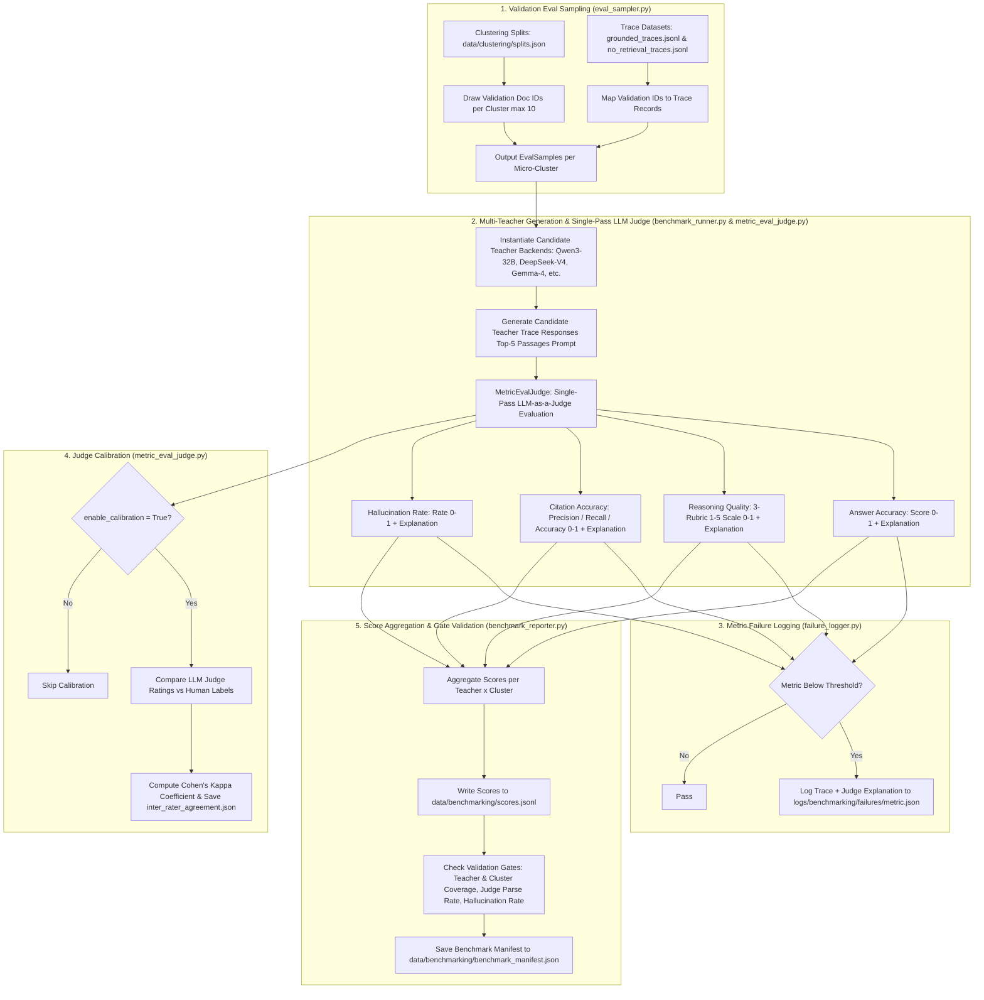

# Step 6: Teacher Benchmarking (`lib/s6_teacher_benchmarking`)

This module implements **Step 6 (Teacher Benchmarking)** of the Semantics Layer Pipeline. It samples validation items across micro-clusters, evaluates candidate Teacher LLMs across four scoring dimensions in a single structured JSON pass via `MetricEvalJudge` (answer accuracy, reasoning quality, citation accuracy, and hallucination rate, accompanied by qualitative explanations), calculates inter-rater Cohen's Kappa calibration against human labels, aggregates per-teacher $\times$ cluster scores, and validates benchmark quality gates.

---

## 1. Objectives

- **Multi-Teacher Candidate Evaluation**: Evaluate candidate Teacher LLMs (`Qwen/Qwen3-32B`, `DeepSeek-V4-Flash`, `Gemma-4-31B`, etc.) across each micro-cluster discovered in Step 5 (`lib/s5_clustering`).
- **Validation Eval Sampling**: Draw evaluation samples (`EvalSample`) from cluster validation splits (`splits.json`) and map them to their corresponding grounded or no-retrieval trace records from Step 4 (`lib/s4_rad_prep`).
- **Single-Pass Four-Dimensional LLM Judge Scoring**: Score candidate teacher responses in a single LLM-as-a-Judge pass (`MetricEvalJudge`) across four dimensions, capturing numerical scores and qualitative explanations:
  1. **Answer Accuracy**: Semantic and factual correctness rating against ground truth ($[0.0, 1.0]$) + explanation.
  2. **Reasoning Quality**: Rubric rating step validity, logical coherence, and absence of circular reasoning (1–5 scale, normalized to $[0.0, 1.0]$) + explanation.
  3. **Citation Accuracy**: Precision, recall, and overall citation accuracy ($[0.0, 1.0]$) against context passages + explanation.
  4. **Hallucination Detection**: Rate of ungrounded or contradicted claims ($[0.0, 1.0]$) + explanation.
- **Judge Calibration & Cohen's Kappa**: Compute Cohen's Kappa coefficient ($\kappa$) to measure inter-rater agreement between LLM Judge ratings and human labels when calibration data is provided (`enable_calibration=True`).
- **Per-Cluster Teacher Score Logging & Gating**: Aggregate per-sample scores into per-teacher $\times$ cluster metrics (`scores.jsonl`), log failure records with judge explanations to `logs/benchmarking/failures/`, and validate pipeline quality gates.

---

## 2. Inputs

- **Cluster Splits & Manifests**: `cfg.clustering.splits_path` (`data/clustering/splits.json`) — Micro-cluster validation split document IDs from Step 5.
- **Trace Datasets**: `cfg.rad.traces_dir` (`data/rad_prep/traces/grounded_traces.jsonl` & `no_retrieval_traces.jsonl`) — Grounded and no-retrieval trace records from Step 4.
- **QA Probe Samples**: `cfg.rad.qa_samples_path` (`evals/dapt/probe_qa.jsonl`) — Original QA questions, ground truth, and choices.
- **Human Labels (Optional)**: `cfg.benchmarking.human_labels_path` — Human-annotated quality labels for LLM judge inter-rater calibration.

---

## 3. Outputs

1. **Per-Teacher $\times$ Cluster Scores**: `cfg.benchmarking.scores_path` (`data/benchmarking/scores.jsonl`) — Line-delimited JSON recording per-teacher and per-cluster scores for `answer_accuracy`, `reasoning_quality`, `citation_precision`, `citation_recall`, `citation_accuracy`, `hallucination_rate`, and `no_retrieval_fraction`.
2. **Benchmark Manifest**: `cfg.benchmarking.manifest_path` (`data/benchmarking/benchmark_manifest.json`) — Global execution status (`complete` / `failed`), total sample counts, per-teacher aggregate means across all clusters, and warning logs.
3. **Metric Failure Logs**: `logs/benchmarking/failures/<metric_name>.json` — Structured failure records including full prompts, responses, metric scores, failure reasons, and qualitative judge explanations.
4. **LLM Judge Calibration Log**: `cfg.benchmarking.calibration_log_path` (`logs/benchmarking/judge_calibration.jsonl`) — Log of judge prompt responses and parsed scores.
5. **Inter-Rater Agreement Log**: `cfg.benchmarking.inter_rater_log_path` (`logs/benchmarking/inter_rater_agreement.json`) — Cohen's Kappa score ($\kappa$) and calibration agreement statistics.

---

## 4. Configurations

All parameters are defined in `lib/utils/config.py` under `TeacherBenchmarkingConfig` (`cfg.benchmarking`), overridable via environment variables:

| Parameter & Environment Variable | Default Value | Description |
| :--- | :---: | :--- |
| `cfg.benchmarking.candidate_teachers` `Env: BENCHMARK_TEACHERS` | `["Qwen/` `Qwen3-1.7B"]` | List of candidate teacher model identifiers. |
| `cfg.benchmarking.teacher_backend` `Env: BENCHMARK_TEACHER_BACKEND` | `hf_local` | Backend for candidate teacher trace generation (`hf_local`, `api`, `bedrock`). |
| `cfg.benchmarking.teacher_max_new_tokens` `Env: BENCHMARK_TEACHER_MAX_NEW_TOKENS` | `1024` | Max tokens generated for teacher reasoning traces (prevents mid-sentence truncation). |
| `cfg.benchmarking.teacher_batch_size` `Env: BENCHMARK_TEACHER_BATCH_SIZE` | `16` | Batch size or concurrent worker count for teacher inference. |
| `cfg.benchmarking.judge_backend` `Env: BENCHMARK_JUDGE_BACKEND` | `api` | Backend provider for LLM reasoning judge (`api`, `hf_local`, `bedrock`). |
| `cfg.benchmarking.judge_model_name` `Env: BENCHMARK_JUDGE_MODEL` | `""` | Model ID for LLM judge. |
| `cfg.benchmarking.judge_api_url` `Env: BENCHMARK_JUDGE_API_URL` | `None` | Endpoint URL for API-based LLM judge. |
| `cfg.benchmarking.judge_api_key` `Env: BENCHMARK_JUDGE_API_KEY` | `None` | API key for LLM judge service. |
| `cfg.benchmarking.judge_max_new_tokens` `Env: BENCHMARK_JUDGE_MAX_NEW_TOKENS` | `512` | Max tokens returned by LLM judge (supports multi-metric JSON + explanations). |
| `cfg.benchmarking.eval_sample_size` `Env: BENCHMARK_EVAL_SAMPLE_SIZE` | `10` | Max validation samples drawn per micro-cluster for benchmark. |
| `cfg.benchmarking.min_eval_samples` `Env: BENCHMARK_MIN_EVAL_SAMPLES` | `2` | Minimum required samples per cluster. |
| `cfg.benchmarking.hallucination_threshold` `Env: BENCHMARK_HALLUCINATION_THRESHOLD` | `0.25` | Hallucination rate threshold above which a failure warning record is logged. |
| `cfg.benchmarking.enable_calibration` `Env: BENCHMARK_ENABLE_CALIBRATION` | `False` | Enable Cohen's Kappa inter-rater agreement evaluation against human labels. |
| `cfg.benchmarking.human_labels_path` `Env: BENCHMARK_HUMAN_LABELS_PATH` | `data/benchmarking/` `human_labels.jsonl` | Input file path for human ground-truth labels. |
| `cfg.benchmarking.scores_path` `Env: BENCHMARK_SCORES_PATH` | `data/benchmarking/` `scores.jsonl` | Output JSONL file path for per-teacher $\times$ cluster scores. |
| `cfg.benchmarking.manifest_path` `Env: BENCHMARK_MANIFEST_PATH` | `data/benchmarking/` `benchmark_manifest.json` | Output JSON file path for benchmark execution manifest. |
| `cfg.benchmarking.calibration_log_path` `Env: BENCHMARK_CALIBRATION_LOG_PATH` | `logs/benchmarking/` `judge_calibration.jsonl` | Log file for LLM judge prompts and responses. |
| `cfg.benchmarking.inter_rater_log_path` `Env: BENCHMARK_INTER_RATER_LOG_PATH` | `logs/benchmarking/` `inter_rater_agreement.json` | Output log file for Cohen's Kappa agreement metrics. |

---

## 5. List of Modules and their description

### 1. `teacher_benchmarking.py` (`run_teacher_benchmarking`)
- **Role**: Phase 2 Step 2.1 Teacher Benchmarking pipeline orchestrator.
- **Functions & Classes**:
  - `run_teacher_benchmarking(cfg: PipelineConfig, ...)`: Coordinates evaluation sampling (`run_eval_sampling`), candidate trace generation and scoring (`run_benchmark_generation_and_scoring`), optional inter-rater calibration (`run_cohen_kappa_evaluation`), and report generation (`run_benchmark_reporting`).

### 2. `eval_sampler.py` (`run_eval_sampling`, `load_traces_lookup`, `EvalSample`)
- **Role**: Evaluation sampling and trace lookup mapping module.
- **Functions & Classes**:
  - `EvalSample`: Dataclass storing `sample_id`, `cluster_id`, `cluster_label`, `question`, `ground_truth`, `retrieved_context`, and `no_retrieval`.
  - `load_traces_lookup(cfg)`: Reads `grounded_traces.jsonl` and `no_retrieval_traces.jsonl` into a dictionary indexed by `sample_id`.
  - `run_eval_sampling(cfg)`: Draws validation sample document IDs from `splits.json` per micro-cluster (up to `eval_sample_size=10`). Maps document IDs to trace records (using deterministic hash-based fallback if IDs differ), ensuring $\ge min\_eval\_samples$ per cluster.

### 3. `benchmark_runner.py` (`run_benchmark_generation_and_scoring`, `make_teacher_backend`, `build_benchmark_prompt`)
- **Role**: Candidate teacher inference execution and trace evaluation coordinator.
- **Functions & Classes**:
  - `make_teacher_backend(cfg, teacher_name)`: Instantiates `LocalHFBackend`, `APIBackend`, or `BedrockBackend` for a specific candidate teacher.
  - `build_benchmark_prompt(question, ground_truth, retrieved_context, no_retrieval)`: Formats grounded (query + top-5 retrieved context passages + ground truth) or no-retrieval prompts instructing the teacher to reason step-by-step and wrap its final answer in `\boxed{}`. Context passages are capped to top-5 to prevent context over-population degeneration.
  - `run_benchmark_generation_and_scoring(...)`: Iterates over candidate teachers and micro-clusters, generates candidate response traces, scores traces via `MetricEvalJudge`, and logs low-scoring records via `BenchmarkFailureLogger`.

### 4. `metric_eval_judge.py` (`MetricEvalJudge`, `make_judge_backend`, `evaluate_trace`, `log_calibration_record`, `run_cohen_kappa_evaluation`)
- **Role**: Unified LLM-as-a-Judge multi-metric evaluation engine and Cohen's Kappa calibration manager.
- **Functions & Classes**:
  - `make_judge_backend(cfg)`: Instantiates the judge inference backend (`APIBackend`, `LocalHFBackend`, `BedrockBackend`).
  - `MetricEvalJudge`: Evaluates candidate teacher traces in a single structured JSON pass across Answer Accuracy, Reasoning Quality, Citation Accuracy, and Hallucination Rate.
    - `answer_accuracy`: Score $[0.0, 1.0]$ + explanation.
    - `reasoning_quality`: `step_validity`, `logical_coherence`, `absence_of_circular_reasoning` on 1–5 scale (normalized to $[0.0, 1.0]$) + explanation.
    - `citation_accuracy`: Precision, recall, and overall citation accuracy $[0.0, 1.0]$ + explanation (`None` for `no_retrieval` traces).
    - `hallucination`: Hallucination rate $[0.0, 1.0]$ + explanation.
    - Performs structured JSON parsing with a single retry mechanism on parse failure.
  - `log_calibration_record(...)`: Logs judge prompt responses and scores when calibration mode is active.
  - `run_cohen_kappa_evaluation(cfg)`: Loads human labels from `human_labels.jsonl`, compares LLM judge ratings against human ratings on identical samples, computes Cohen's Kappa coefficient ($\kappa$), and logs inter-rater agreement to `inter_rater_agreement.json`.

### 5. `failure_logger.py` (`BenchmarkFailureLogger`)
- **Role**: Metric failure logger recording low-scoring or problematic traces for debugging.
- **Functions & Classes**:
  - `BenchmarkFailureLogger`: Evaluates scored sample metrics against target thresholds (answer accuracy $<1.0$, reasoning quality $<1.0$, citation accuracy $<1.0$, hallucination rate $>0.25$).
  - `check_and_log_failures(sample, teacher, prompt, response, eval_result)`: Writes detailed JSON failure logs (including prompt, response, metric score, failure reason, and judge explanation) to `logs/benchmarking/failures/<metric_name>.json`.

### 6. `benchmark_reporter.py` (`run_benchmark_reporting`)
- **Role**: Score aggregation, validation gate enforcement, and report/manifest writer.
- **Functions & Classes**:
  - `run_benchmark_reporting(cfg, records, expected_teacher_count, expected_cluster_count)`: Aggregates per-sample scores into per-teacher $\times$ cluster score records. Writes `scores.jsonl`. Computes per-teacher aggregate means across all micro-clusters. Enforces validation gates (hard fail if teacher/cluster coverage is incomplete; warnings if judge parse failures $> 5\%$ or overall hallucination rate $> 25\%$). Writes `benchmark_manifest.json`.

### 7. `__init__.py`
- **Role**: Public API exports for `lib.s6_teacher_benchmarking`.
- **Exports**: `run_teacher_benchmarking`.

---

## 6. Overall functional flow of the Step

### Detailed Functional Walkthrough

1. **Validation Eval Sampling**: `run_eval_sampling` reads `data/clustering/splits.json` from Step 5 and loads trace datasets (`grounded_traces.jsonl` and `no_retrieval_traces.jsonl`) from Step 4. For each micro-cluster, it samples up to `eval_sample_size` (default 10) validation documents and maps them to QA trace records (`EvalSample`), using deterministic hash-based fallback if ID mappings differ.
2. **Candidate Teacher Trace Generation**: `run_benchmark_generation_and_scoring` iterates through candidate teacher models defined in `cfg.benchmarking.candidate_teachers`. For each sample, it builds a benchmark prompt (incorporating top-5 retrieved context passages for grounded samples) and queries the candidate teacher backend to generate a reasoning trace.
3. **Single-Pass LLM-as-a-Judge Evaluation**:
   - `MetricEvalJudge.evaluate_trace(...)` sends the prompt, ground truth, retrieved context, and candidate teacher response trace to the LLM Judge backend in a single pass.
   - The LLM Judge returns a structured JSON dictionary containing quantitative scores and qualitative explanations across all four dimensions (`answer_accuracy`, `reasoning_quality`, `citation_accuracy`, `hallucination`).
   - `MetricEvalJudge` parses the structured JSON (with a single retry mechanism on parse failure) and normalizes the scores to $[0.0, 1.0]$.
4. **Metric Failure Logging**: `BenchmarkFailureLogger` evaluates the scored results. If any metric falls below target thresholds (e.g. answer accuracy $<1.0$, hallucination rate $>0.25$), it records full trace details, prompts, responses, metric scores, failure reasons, and qualitative judge explanations into `logs/benchmarking/failures/<metric_name>.json`.
5. **Inter-Rater Agreement Calibration**: If `enable_calibration=True`, `run_cohen_kappa_evaluation` compares LLM judge ratings against human ground-truth labels (`human_labels.jsonl`), computes Cohen's Kappa ($\kappa$), and logs calibration results to `inter_rater_agreement.json`.
6. **Score Aggregation & Manifest Reporting**: `run_benchmark_reporting` aggregates per-sample scores into per-teacher $\times$ cluster records, saving them to `data/benchmarking/scores.jsonl`. It computes global per-teacher mean scores across all micro-clusters. Finally, it enforces validation gates (verifying complete teacher/cluster coverage, judge parse success rate $>95\%$, and overall hallucination rate $\le 25\%$), outputting `benchmark_manifest.json`.
